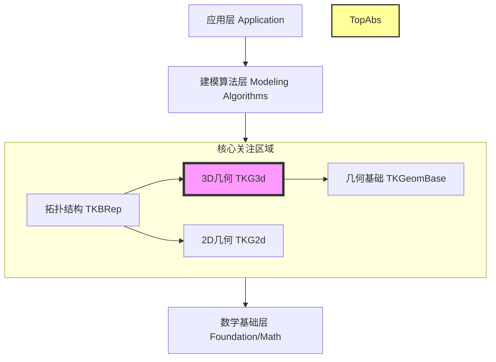

# OCCT 建模数据层 (Modeling Data) - 系统架构与业务功能

## 1. 业务功能 (Business Function)

Open CASCADE Technology (OCCT) 的核心业务目标是提供一套完整的**三维几何建模内核 (3D Geometric Modeling Kernel)**。
在 `ModelingData` 这一层，特别是以 `TopAbs` 和 `TKG3d` 为代表的模块，主要承担以下核心业务功能：

*   **几何表达 (Geometric Representation)**:
    *   提供精确的数学描述来表达三维空间中的点、向量、曲线（如直线、圆、B样条曲线）和曲面（如平面、圆柱面、NURBS曲面）。
    *   支持解析几何（Analytic Geometry）和自由形式几何（Free-form Geometry）。

*   **拓扑定义 (Topological Definition)**:
    *   通过 `TopAbs` 定义了一套描述物体“连接关系”的标准词汇（顶点、边、面、实体等）。
    *   描述几何元素如何通过边界（Boundary）相互连接，从而构成复杂的实体。
    *   管理“方向性”（Orientation），即几何体是正向还是反向，这对于定义实体的“内部”和“外部”至关重要。

*   **基础算法支持 (Fundamental Algorithms)**:
    *   提供计算几何属性（长度、面积、体积、曲率）的基础工具。
    *   提供几何逼近、投影、插值等底层数学运算。

简而言之，该层的业务价值在于**“将现实世界的物理形状转化为计算机可处理的数学模型”**。

## 2. 设计架构 (Design Architecture)

OCCT 采用分层架构设计，`ModelingData` 处于核心位置。

### 架构分层图

### 关键模块职责

1.  **TopAbs (Abstract Topology)**:
    *   **定位**: 位于架构的最底层，是所有拓扑结构的“元数据”定义。
    *   **职责**: 不包含具体的几何数据，仅定义了拓扑的**类型** (ShapeEnum)、**状态** (State) 和**方向** (Orientation)。它是整个拓扑系统的“字典”。

2.  **TKG3d (Toolkit Geometry 3d)**:
    *   **定位**: 纯几何数据的容器。
    *   **职责**: 包含 `Geom` 包，定义了数学上的曲线和曲面。它不关心这些曲面是如何连接的，只关心曲面本身的数学方程。

3.  **TKBRep (Boundary Representation)**:
    *   **定位**: 将拓扑 (`TopAbs`) 与几何 (`TKG3d`) 结合。
    *   **职责**: 使用 B-Rep (边界表示法) 来构建实体。例如，一个“面 (Face)”是由一个“曲面 (Geom_Surface)”加上限制其范围的“边 (Edge)”构成的。

## 3. 技术架构 (Technical Architecture)

### 核心技术特点

*   **基于句柄的内存管理 (Handle-based Memory Management)**:
    *   OCCT 使用引用计数机制（`Standard_Transient` 和 `Handle`）来管理几何对象。
    *   **优势**: 实现了对象共享（例如两个面共享同一条边），减少内存占用并简化了生命周期管理。

*   **参数化几何 (Parametric Geometry)**:
    *   所有的曲线和曲面都是参数化的。
    *   曲线 $C(u)$：通过一个参数 $u$ 映射到 3D 空间点。
    *   曲面 $S(u, v)$：通过两个参数 $u, v$ 映射到 3D 空间点。

*   **适配器模式 (Adaptor Pattern)**:
    *   为了让通用算法（如求交、逼近）能处理不同类型的几何对象，OCCT 定义了 `Adaptor3d` 接口。
    *   **优势**: 算法只需针对 `Adaptor3d` 接口编程，无需关心具体是 B样条曲面还是圆柱面。

*   **精度控制 (Precision Control)**:
    *   引入“公差 (Tolerance)”概念。因为浮点数运算存在误差，两个点在公差范围内即被视为重合。这在 `TopAbs` 和 B-Rep 结构中至关重要。
