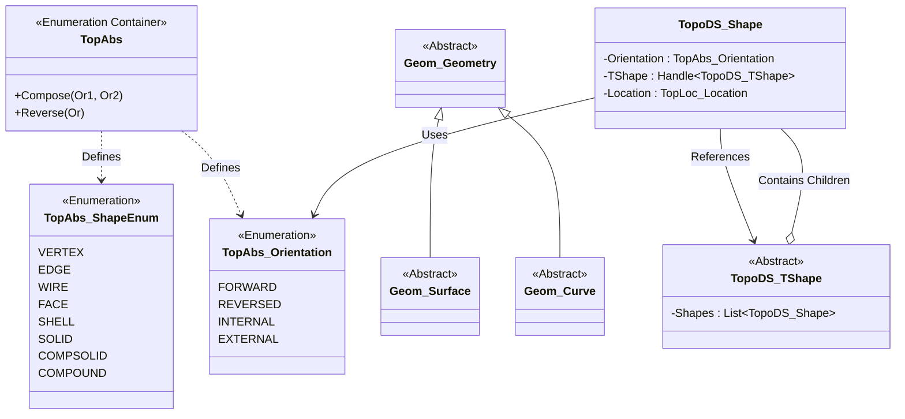
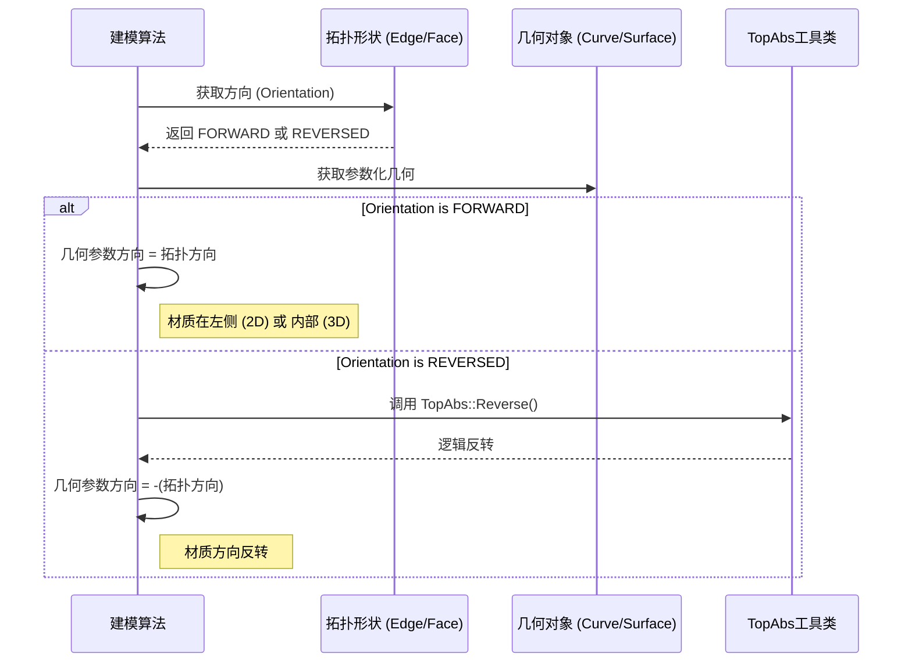

# OCCT 建模数据层 - 详细设计与流程

## 1. 核心数据结构设计 (Data Structure Design)

OCCT 的核心设计思想是 **边界表示法 (Boundary Representation, B-Rep)**。
设计上严格区分了 **拓扑 (Topology)** 和 **几何 (Geometry)**。

### 类图关系 (Class Diagram)



## 2. 实体构建数据流 (Data Flow)

一个复杂的实体（如立方体）的构建过程体现了数据流向：从纯数学几何到具体拓扑实体。

```mermaid
graph LR
    subgraph Geometry [几何定义 (TKG3d)]
        P[gp_Pnt (点坐标)]
        C[Geom_Line (直线方程)]
        S[Geom_Plane (平面方程)]
    end

    subgraph Topology [拓扑构建 (TopAbs/BRep)]
        V[TopoDS_Vertex (顶点)]
        E[TopoDS_Edge (边)]
        W[TopoDS_Wire (线框)]
        F[TopoDS_Face (面)]
        Sh[TopoDS_Shell (壳)]
        So[TopoDS_Solid (实体)]
    end

    P -->|封装| V
    C -->|限制范围 + 顶点| E
    E -->|连接成环| W
    S -->|限制边界 + 线框| F
    F -->|缝合| Sh
    Sh -->|闭合| So
```

## 3. 关键算法流程：方向处理 (Orientation Process)

`TopAbs` 中的方向处理是设计的核心难点。以下流程展示了如何判断一个面是“孔”还是“外轮廓”，或者边的方向是否与曲线参数方向一致。



## 4. 拓扑层级设计 (Topological Hierarchy)

`TopAbs_ShapeEnum` 定义了严格的包含层级，这是数据结构设计的核心约束：

1.  **Compound (复合体)**: 包含任意类型的 Shape。
2.  **CompSolid (复合实体)**: 由面连接的一组 Solid。
3.  **Solid (实体)**: 3D 空间的有限部分，由 Shell 包围。
4.  **Shell (壳)**: 一组连接的 Face，通常作为 Solid 的边界。
5.  **Face (面)**: 曲面的一部分，由 Wire 限制边界。
6.  **Wire (线框)**: 一组连接的 Edge。
7.  **Edge (边)**: 曲线的一部分，由 Vertex 限制端点。
8.  **Vertex (顶点)**: 3D 空间的一个点。
