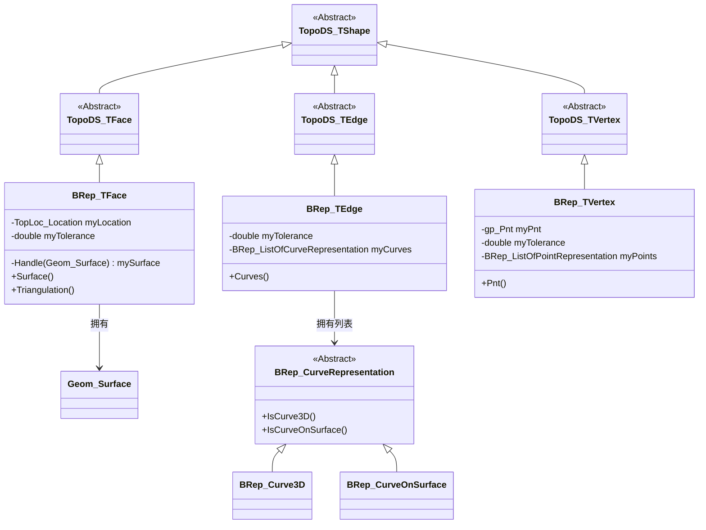
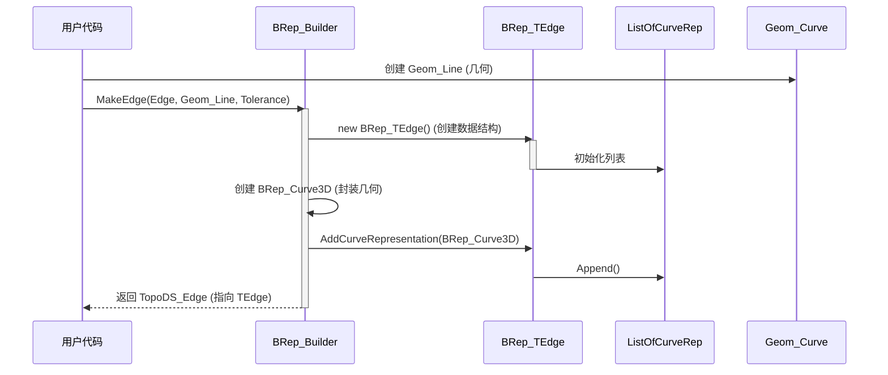
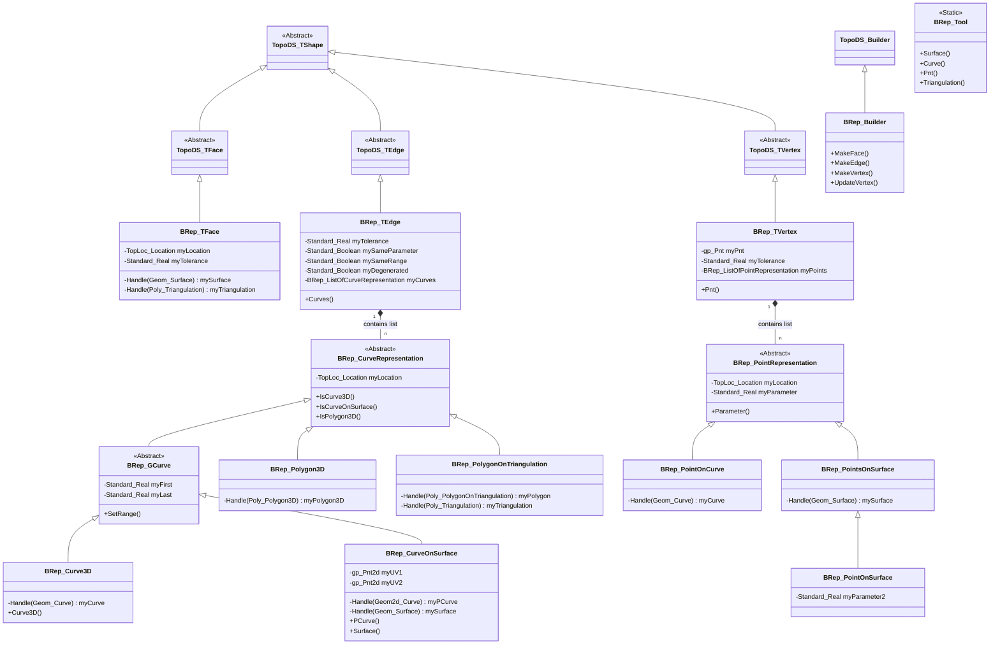

# OCCT BRep 模块技术架构文档

## 1. 架构概览 (Architecture Overview)

`BRep` 模块采用了 **桥接模式 (Bridge Pattern)** 和 **组合模式 (Composite Pattern)** 的混合架构，用于连接 `TopoDS`（拓扑定义）和 `Geom`（几何定义）。

*   **继承架构**：`BRep` 中的类（如 `BRep_TFace`）继承自 `TopoDS` 中的抽象基类（如 `TopoDS_TFace`）。
*   **关联架构**：`BRep` 类持有 `Geom` 类（如 `Geom_Surface`）的句柄（Handle）。

## 2. 类图 (Class Diagram)

## 3. 关键数据结构与算法 (Key Data Structures & Algorithms)

### 3.1 面的数据结构 (`BRep_TFace`)
*   **核心字段**：
    *   `mySurface`: `Handle(Geom_Surface)` - 指向几何曲面的智能指针。
    *   `myLocation`: `TopLoc_Location` - 面相对于其定义位置的局部坐标变换。
    *   `myTolerance`: `Standard_Real` - 面的几何误差容限。
*   **设计意图**：将几何曲面与拓扑面解耦。位置 (`Location`) 的存在允许同一个几何曲面在空间不同位置被复用（虽然在 Face 级别较少见，但在更上层的 Instance 中很常见）。

### 3.2 边的数据结构 (`BRep_TEdge`)
*   **核心字段**：
    *   `myCurves`: `BRep_ListOfCurveRepresentation` - 这是一个多态列表。
*   **设计意图 (重要)**：一条边在 3D 空间中是一条曲线，但在它所属的每个面上，它也是一条 2D 参数曲线 (pcurve)。
    *   如果一条边是两个面的公共边界，它将包含：
        1.  一个 `BRep_Curve3D` (可选，但在显示时通常需要)。
        2.  两个 `BRep_CurveOnSurface` (分别对应两个面)。
    *   算法在处理边时，会遍历这个列表找到与当前上下文（例如“我在哪个面上处理这条边？”）匹配的表示。

### 3.3 访问者模式/工具类 (`BRep_Tool`)
*   OCCT 不鼓励直接转换（Cast）`TopoDS_Shape` 到 `BRep` 类来访问数据。
*   **设计模式**：使用 `BRep_Tool` 作为静态访问器。
*   **流程**：
    1.  用户持有 `TopoDS_Face`。
    2.  调用 `BRep_Tool::Surface(face)`。
    3.  `BRep_Tool` 内部提取 `TopoDS_TShape`，向下转型为 `BRep_TFace`，获取 `Geom_Surface`，并应用 `Face` 的 `Location`。

## 4. 关键接口说明 (Key Interface Descriptions)

以下列出系统中关键模块的函数接口说明。

### 4.1 `BRep_Builder` (构建器)

| 函数接口 (Signature) | 输入参数 (Input) | 输出参数 (Output) | 功能说明 (Functionality) |
| :--- | :--- | :--- | :--- |
| `MakeFace(TopoDS_Face& F, const Handle(Geom_Surface)& S, const Standard_Real Tol)` | `S`: 几何曲面 `Tol`: 公差 | `F`: 构建好的拓扑面 | 创建一个新的面，并将几何曲面 `S` 绑定到该面上。 |
| `MakeEdge(TopoDS_Edge& E, const Handle(Geom_Curve)& C, const Standard_Real Tol)` | `C`: 3D 几何曲线 `Tol`: 公差 | `E`: 构建好的拓扑边 | 创建一条边，并赋予其 3D 空间曲线几何。 |
| `UpdateEdge(const TopoDS_Edge& E, const Handle(Geom2d_Curve)& C, const TopoDS_Face& F, const Standard_Real Tol)` | `E`: 待更新的边 `C`: 2D 参数曲线 `F`: 所在的参照面 `Tol`: 公差 | 无 (Void) | 为已有的边添加在特定面 `F` 上的 2D 参数曲线表示 (PCurve)。这是建立拓扑连接性的关键步骤。 |
| `MakeVertex(TopoDS_Vertex& V, const gp_Pnt& P, const Standard_Real Tol)` | `P`: 3D 笛卡尔坐标点 `Tol`: 公差 | `V`: 构建好的拓扑顶点 | 创建一个顶点，并赋予其确定的空间坐标。 |

### 4.2 `BRep_Tool` (工具类)

| 函数接口 (Signature) | 输入参数 (Input) | 输出参数 (Output) | 功能说明 (Functionality) |
| :--- | :--- | :--- | :--- |
| `Surface(const TopoDS_Face& F, TopLoc_Location& L)` | `F`: 目标拓扑面 | `L`: 返回曲面的位置变换 **Return**: `Handle(Geom_Surface)` | 获取面对应的几何曲面对象以及其位置变换矩阵。 |
| `Curve(const TopoDS_Edge& E, Standard_Real& First, Standard_Real& Last)` | `E`: 目标拓扑边 | `First`, `Last`: 曲线的参数范围 **Return**: `Handle(Geom_Curve)` | 获取边的 3D 几何曲线及其参数区间。如果边没有 3D 曲线，返回 Null。 |
| `CurveOnSurface(const TopoDS_Edge& E, const TopoDS_Face& F, Standard_Real& First, Standard_Real& Last)` | `E`: 目标边 `F`: 参照面 | `First`, `Last`: 参数范围 **Return**: `Handle(Geom2d_Curve)` | 获取边 `E` 在面 `F` 上的 2D 参数曲线 (PCurve)。用于参数空间计算。 |
| `Pnt(const TopoDS_Vertex& V)` | `V`: 目标顶点 | **Return**: `gp_Pnt` (3D 点) | 获取顶点的 3D 坐标。 |

## 5. 数据流图 (Data Flow Diagram)

**场景：构建一条边 (Edge Construction Flow)**

## 6. 核心算法流程 (Core Algorithm Flow)

### 6.1 边的同一性检查 (Same Parameter)
在 `BRep` 结构中，边可以有 3D 曲线和 2D 曲线。OCCT 要求它们满足 "Same Parameter" 属性，即同一个参数 $t$ 在 3D 曲线上的点
$$
C_{3d}(t)
$$
和在 2D 曲线上的点映射到 3D 空间后 
$$
S(C_{2d}(t))
$$
之间的距离必须小于公差。

**算法流程**：
1.  输入：一条边 `E`。
2. 获取 `E` 的 3D 曲线 
   $$
   C_{3d}
   $$
   和面 `F` 上的 2D 曲线 $
   $$
   C_{2d}
   $$
   $。
3.  在参数范围 $[t_{min}, t_{max}]$ 内进行采样。
4.  对于每个采样点 $t_i$：
    *   计算 $P_1 = C_{3d}(t_i)$
    *   计算 $uv = C_{2d}(t_i)$
    *   计算 $P_2 = Surface(uv)$
    *   检查 $Distance(P_1, P_2) \le Tolerance$
5.  如果所有点都满足，标记 `SameParameter` 为 True。
6.  如果不满足，可能需要重新参数化 2D 曲线或扩大边的公差。

基于对源代码的详细分析，为您绘制了 `BRep` 模块的详细类图。

### BRep 模块类图 (Class Diagram)

这个类图展示了 `BRep` 如何通过继承 `TopoDS` 来实现具体的拓扑结构，并如何通过 `BRep_CurveRepresentation` 和 `BRep_PointRepresentation` 来灵活地存储几何信息。

### 图解说明

1.  **左侧 (Topology Implementation)**:
    *   **`BRep_TFace`**: 核心是存储了 `Geom_Surface`（几何面）和 `TopLoc_Location`（位置变换）。
    *   **`BRep_TEdge`**: 核心是 `myCurves` 列表。一条边可以同时拥有：
        *   一个 `BRep_Curve3D`（空间曲线，用于显示）。
        *   多个 `BRep_CurveOnSurface`（PCurve，用于在不同面上进行参数计算）。
        *   多个 `BRep_Polygon3D`（离散多边形，用于快速显示）。
    *   **`BRep_TVertex`**: 存储了确定的 3D 坐标 `myPnt`，同时也维护一个 `myPoints` 列表，记录该点在依附的边或面上的参数值。

2.  **中间 (Curve Representation Hierarchy)**:
    *   **`BRep_CurveRepresentation`**: 所有边几何的基类。
    *   **`BRep_GCurve`**: 引入了参数范围 `[First, Last]` 的概念，适用于解析曲线。
    *   **`BRep_Curve3D`**: 包装了 `Geom_Curve`。
    *   **`BRep_CurveOnSurface`**: 包装了 `Geom2d_Curve` 和 `Geom_Surface`。

3.  **右侧 (Point Representation Hierarchy)**:
    *   **`BRep_PointRepresentation`**: 所有点参数信息的基类，存储了一个参数 `myParameter` (U)。
    *   **`BRep_PointOnSurface`**: 继承自中间类 `BRep_PointsOnSurface`，增加了 `myParameter2` (V)，从而构成了 (U, V) 二维参数。

4.  **下方 (Tools)**:
    *   **`BRep_Builder`**: 负责创建上述复杂结构的“工厂”。
    *   **`BRep_Tool`**: 负责从上述结构中安全读取数据的“阅读器”。
