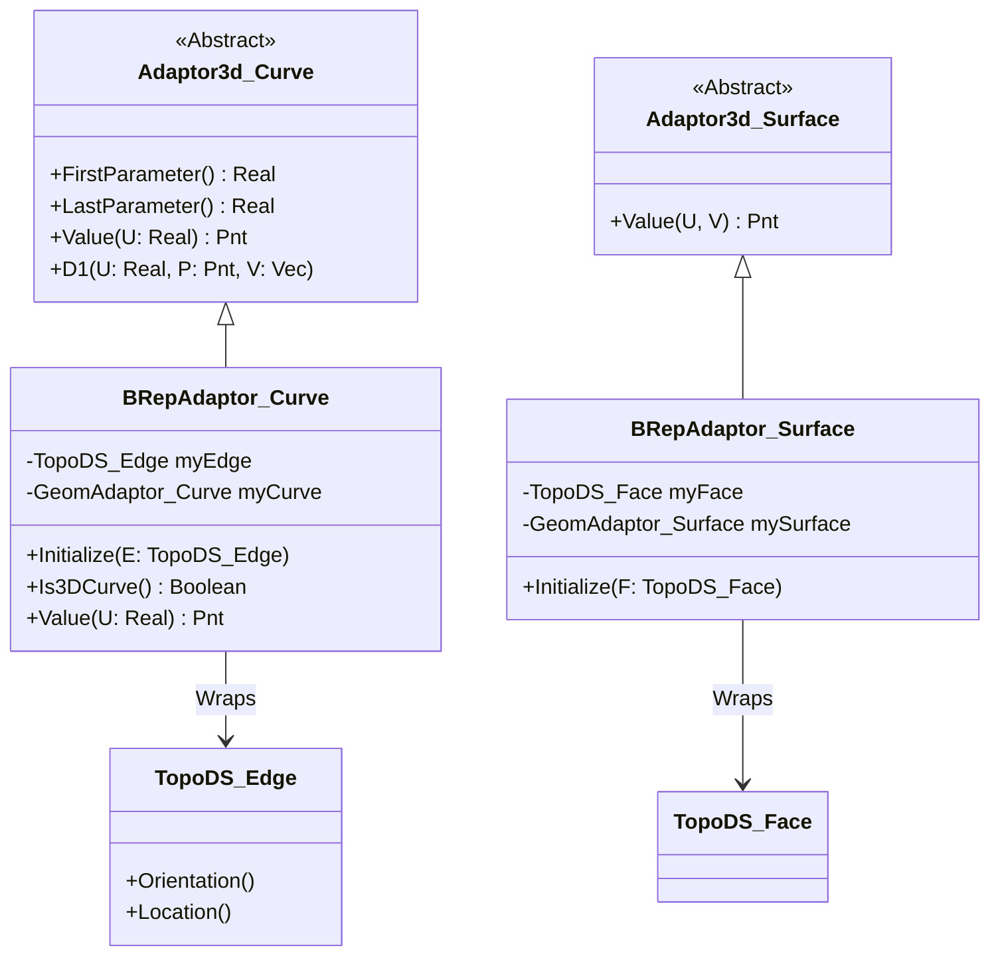

# BRepAdaptor 技术详细设计

本文件提供了 `BRepAdaptor` 模块的技术细节，包括类图、流程设计、关键算法逻辑及 API 说明。

## 1. 系统类图 (Class Diagram)

使用 Mermaid 语法展示核心类的继承与关联关系。



## 2. 关键流程与算法设计

### 2.1 初始化流程 (Initialize Flow)
当用户创建一个 `BRepAdaptor_Curve` 时，系统执行以下步骤：
1.  **提取几何**：从 `TopoDS_Edge` 中提取底层的 `Geom_Curve`。
2.  **提取范围**：从 `TopoDS_Edge` 提取参数范围 $(U_{min}, U_{max})$。
3.  **提取变换**：获取 `TopoDS_Edge` 的 `TopLoc_Location` (坐标变换矩阵 $T$)。
4.  **构建内部适配器**：使用 `GeomAdaptor_Curve` 包装原生几何曲线。
5.  **缓存数据**：存储上述信息以加速后续计算。

### 2.2 求值算法 (Value Evaluation Algorithm)
当调用 `Value(U)` 获取曲线上某点的 3D 坐标时：
1.  **参数映射**：如果 Edge 的方向是 `Reversed`（反向），实际传递给底层曲线的参数是 $U' = First + Last - U$（对于线性重参数化）或根据具体曲线类型处理。*注：通常 BRepAdaptor 处理几何变换，而方向处理需通过 `Adaptor3d_Curve` 的接口规范，通常由调用者通过 `FirstParameter` 和 `LastParameter` 获知，但 BRepAdaptor 会确保 `First < Last`。*
    *   *修正*：在 OCCT 中，`BRepAdaptor_Curve` 会根据 Edge 的 Orientation 调整参数吗？
    *   实际上，`BRepAdaptor` 提供了底层几何的视图。如果 Edge 是 Reversed，几何意义上的“切线”可能需要反转，但参数 $U$ 通常仍遵循底层曲线的定义域，或者通过适配器映射。`BRepAdaptor_Curve` 实际上会将参数限制在 Edge 的范围内，并应用变换 $P_{world} = T \times P_{local}$。
2.  **几何计算**：调用底层 `Geom_Curve->Value(U)` 得到局部坐标点 $P_{local}$。
3.  **空间变换**：应用 Edge 的位置变换 $T$：$P_{final} = P_{local} \times T$。
4.  **返回结果**：返回 $P_{final}$。

### 2.3 数据流图 (Data Flow)

```mermaid
graph LR
    Input[用户输入 U 参数] --> API[BRepAdaptor_Curve::Value(U)]
    API --> Check{Edge 有变换?}
    
    Check -- Yes --> Transform[获取 Location T]
    Check -- No --> Direct
    
    API --> Geom[底层 Geom_Curve::Value(U)]
    Geom --> LocalPnt[局部坐标点 P]
    
    LocalPnt --> ApplyT[应用变换 P' = T * P]
    Transform --> ApplyT
    
    ApplyT --> Output[返回世界坐标点 P']
    Direct --> LocalPnt
```

---

## 3. 函数接口说明 (API Specification)

以下列出 `BRepAdaptor_Curve` 中几个最关键的接口说明。

### 3.1 构造函数 / Initialize
*   **接口原型**：`void Initialize(const TopoDS_Edge& E)`
*   **输入参数**：
    *   `E` (TopoDS_Edge): 需要被适配的拓扑边。
*   **输出参数**：无（修改对象内部状态）。
*   **功能**：重置适配器，加载新的边，提取其几何信息、坐标变换和参数范围。

### 3.2 Value (求值)
*   **接口原型**：`gp_Pnt Value(const Standard_Real U) const`
*   **输入参数**：
    *   `U` (Standard_Real): 曲线上的参数值。
*   **输出参数**：
    *   `Return` (gp_Pnt): 对应参数 U 的 3D 空间坐标点。
*   **功能**：计算曲线上参数 U 处的点，并自动应用 Edge 的坐标变换。

### 3.3 D1 (一阶导数)
*   **接口原型**：`void D1(const Standard_Real U, gp_Pnt& P, gp_Vec& V) const`
*   **输入参数**：
    *   `U` (Standard_Real): 参数值。
*   **输出参数**：
    *   `P` (gp_Pnt): 曲线上的点。
    *   `V` (gp_Vec): 该点处的一阶导数向量（切向量）。
*   **功能**：同时计算点和切向量。注意：如果 Edge 的 Orientation 是 Reversed，切向量的方向可能需要由上层逻辑进一步解释，但 `BRepAdaptor` 通常返回几何上的切线并应用变换矩阵（变换矩阵可能包含旋转）。

### 3.4 Intervals (连续性区间)
*   **接口原型**：`Standard_Integer NbIntervals(const GeomAbs_Shape S) const`
*   **输入参数**：
    *   `S` (GeomAbs_Shape): 所需的连续性级别（如 C1, C2, G1）。
*   **输出参数**：
    *   `Return` (Standard_Integer): 满足该连续性的区间数量。
*   **功能**：对于像 B-Spline 这样分段定义的曲线，某些点可能不满足高阶连续性。此函数用于查询曲线被分成了多少个满足特定连续性的段，以便算法分段处理。
