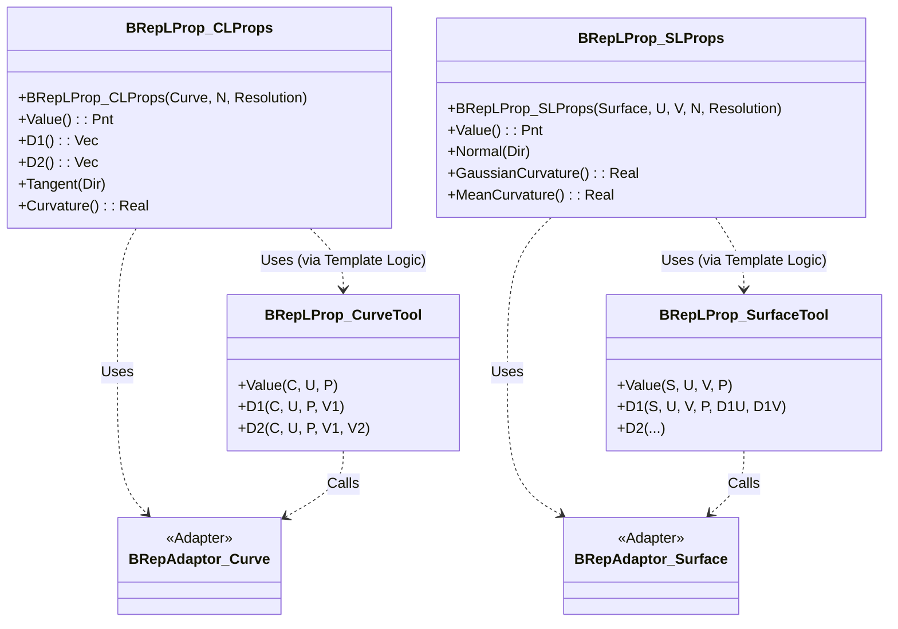
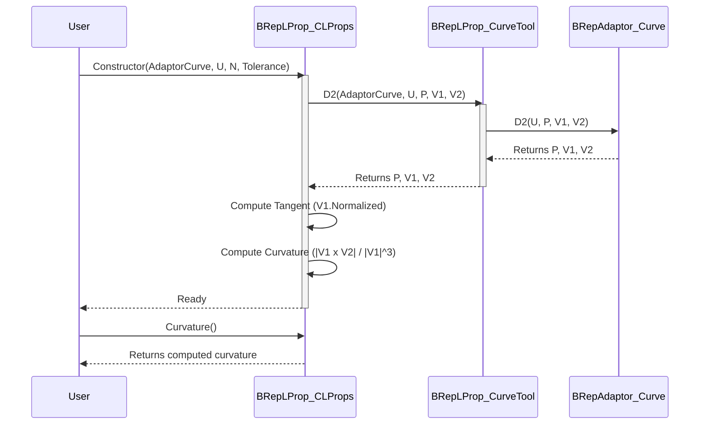
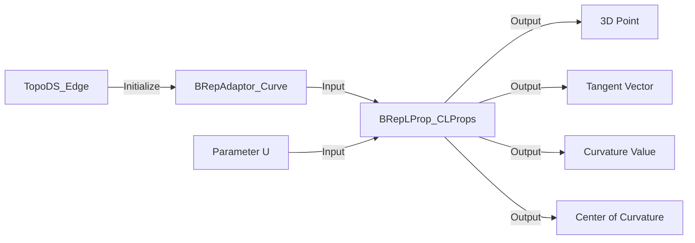

# BRepLProp 技术架构与设计说明

## 1. 技术架构设计

### 1.1 设计模式：适配器与泛型实例化
`BRepLProp` 模块采用了 **适配器模式 (Adapter Pattern)** 和 **泛型编程 (Generic Programming)** 相结合的架构。

*   **泛型核心 (`LProp`)**：OCCT 在 `LProp` 包中定义了与具体几何表示无关的通用数学算法（如计算曲率的数学公式）。这些算法只依赖于抽象的“曲线工具”或“曲面工具”接口。
*   **适配器 (`BRepAdaptor`)**：`BRepAdaptor` 将拓扑结构（`TopoDS_Edge`, `TopoDS_Face`）适配为纯几何接口，屏蔽了底层几何（如 Bezier, BSpline, Circle 等）的差异。
*   **具体实现 (`BRepLProp`)**：本模块通过 `BRepLProp_CurveTool` 和 `BRepLProp_SurfaceTool` 将 `BRepAdaptor` 对接给 `LProp` 的泛型算法，从而实例化出专门处理 BRep 几何的分析类。

### 1.2 类图 (Class Diagram)

## 2. 核心流程与数据流

### 2.1 曲线属性计算流程 (Sequence Diagram)

### 2.2 数据流图 (Data Flow)

## 3. 关键算法与数据结构

### 3.1 曲线曲率计算算法
*   **输入**：参数 $u$，一阶导数 $\mathbf{v}_1 = C'(u)$，二阶导数 $\mathbf{v}_2 = C''(u)$。
*   **公式**：
    $$ \kappa = \frac{||\mathbf{v}_1 \times \mathbf{v}_2||}{||\mathbf{v}_1||^3} $$
*   **逻辑**：
    1.  如果 $||\mathbf{v}_1||$ 小于容差（Resolution），则切线未定义（奇点）。
    2.  计算叉积 $\mathbf{v}_1 \times \mathbf{v}_2$ 的模长。
    3.  除以速率的立方。

### 3.2 曲面属性计算算法 (高斯微分几何)
*   **输入**：一阶偏导数 $\mathbf{r}_u, \mathbf{r}_v$，二阶偏导数 $\mathbf{r}_{uu}, \mathbf{r}_{vv}, \mathbf{r}_{uv}$。
*   **第一基本形式系数**：
    $$ E = \mathbf{r}_u \cdot \mathbf{r}_u, \quad F = \mathbf{r}_u \cdot \mathbf{r}_v, \quad G = \mathbf{r}_v \cdot \mathbf{r}_v $$
*   **单位法向量**：
    $$ \mathbf{n} = \frac{\mathbf{r}_u \times \mathbf{r}_v}{||\mathbf{r}_u \times \mathbf{r}_v||} $$
*   **第二基本形式系数**：
    $$ L = \mathbf{r}_{uu} \cdot \mathbf{n}, \quad M = \mathbf{r}_{uv} \cdot \mathbf{n}, \quad N = \mathbf{r}_{vv} \cdot \mathbf{n} $$
*   **高斯曲率 ($K$) 与平均曲率 ($H$)**：
    $$ K = \frac{LN - M^2}{EG - F^2}, \quad H = \frac{EN + GL - 2FM}{2(EG - F^2)} $$
*   **主曲率**：通过解二次方程 $k^2 - 2Hk + K = 0$ 求解 $k_{min}, k_{max}$。

## 4. 关键函数接口说明

### 4.1 类 `BRepLProp_CLProps` (曲线属性)

| 函数接口 | 输入参数 | 输出参数 | 接口功能 |
| :--- | :--- | :--- | :--- |
| `BRepLProp_CLProps` | `BRepAdaptor_Curve& C`, `int N`, `double Resolution` | (构造函数) | 初始化分析器，`N`为求导阶数(通常1或2)，`Resolution`为线性容差。 |
| `SetParameter` | `double U` | 无 | 设置当前分析的参数 $u$ 并触发重计算。 |
| `Value` | 无 | `gp_Pnt` | 返回曲线在参数 $u$ 处的 3D 点坐标。 |
| `D1` | 无 | `gp_Vec` | 返回一阶导数向量（切线方向 * 速率）。 |
| `Tangent` | `gp_Dir& D` | `void` | 输出单位切向量到 `D`。如果无法计算（如尖点）会抛出异常或返回状态。 |
| `Curvature` | 无 | `double` | 返回标量曲率值。 |
| `CentreOfCurvature` | `gp_Pnt& P` | `void` | 计算曲率圆的圆心位置。 |

### 4.2 类 `BRepLProp_SLProps` (曲面属性)

| 函数接口 | 输入参数 | 输出参数 | 接口功能 |
| :--- | :--- | :--- | :--- |
| `BRepLProp_SLProps` | `BRepAdaptor_Surface& S`, `double U`, `double V`, `int N`, `double Resolution` | (构造函数) | 初始化曲面分析器于参数 $(u, v)$。 |
| `Normal` | 无 | `gp_Dir` | 返回该点的单位法向量。 |
| `D1U`, `D1V` | 无 | `gp_Vec` | 返回 U 方向和 V 方向的一阶偏导数向量。 |
| `GaussianCurvature`| 无 | `double` | 返回高斯曲率（反映曲面不可展性）。 |
| `MeanCurvature` | 无 | `double` | 返回平均曲率。 |
| `MinCurvature` | 无 | `double` | 返回最小主曲率。 |
| `MaxCurvature` | 无 | `double` | 返回最大主曲率。 |
| `CurvatureDirections`| `gp_Dir& MaxD`, `gp_Dir& MinD` | `void` | 获取最大和最小主曲率对应的切线方向（主方向）。 |
| `IsUmbilic` | 无 | `bool` | 判断当前点是否为脐点（即各个方向曲率相等）。 |
