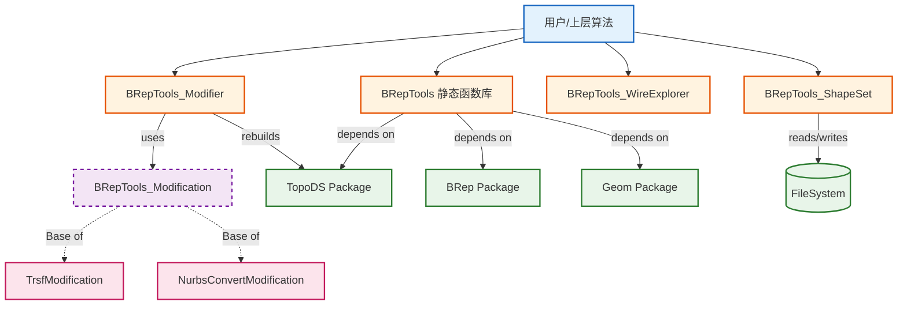

# BRepTools 业务功能与技术架构详解

本文档详细阐述了 Open CASCADE Technology (OCCT) 中 `BRepTools` 模块的业务功能定位及其技术架构设计。

## 1. 业务功能 (Business Function)

`BRepTools` 是 OCCT 建模数据模块（Modeling Data）中的核心工具包之一，主要服务于边界表示（Boundary Representation, BRep）数据结构的辅助处理。它的业务功能可以归纳为以下几个核心领域：

### 1.1 数据持久化与交换
*   **功能描述**：提供将内存中的 BRep 拓扑结构和几何数据保存到磁盘文件（.brep 格式）以及从文件中恢复的能力。
*   **应用场景**：CAD 模型的存档、不同模块间的数据传递、调试过程中的中间状态导出。
*   **核心组件**：`BRepTools_ShapeSet`、`BRepTools::Read`、`BRepTools::Write`。

### 1.2 拓扑结构重构与修改  
*   **功能描述**：提供了一套通用的框架，用于在保持拓扑连接关系（或有控制地改变）的前提下，对模型的几何数据进行修改。例如，对模型进行整体变形、坐标变换、或者将解析曲面转换为 NURBS 曲面。
*   **应用场景**：模型缩放、旋转、平移；几何类型转换（如导出到通用格式前的 NURBS 化）；修复几何公差。
*   **核心组件**：`BRepTools_Modifier`、`BRepTools_Modification` 及其派生类（`TrsfModification`, `NurbsConvertModification`）。

### 1.3 拓扑分析与遍历
*   **功能描述**：提供比底层迭代器更高级的遍历功能。最典型的是按几何连接顺序遍历线框（Wire），确保首尾相接，这在数控加工路径生成或轮廓分析中至关重要。
*   **应用场景**：提取轮廓线数据；检查线框的闭合性；计算模型的边界盒（Bounding Box）和参数范围（UV Bounds）。
*   **核心组件**：`BRepTools_WireExplorer`、`BRepTools::UVBounds`、`BRepTools::OuterWire`。

### 1.4 模型修复与缝合
*   **功能描述**：支持将散乱的面（Face）组合成壳（Shell）或实体（Solid），并处理共享边的缝合。同时支持替换模型中的特定子形状（如替换坏边或坏面）。
*   **应用场景**：从外部导入的面片数据重建实体；局部模型编辑与替换。
*   **核心组件**：`BRepTools_Quilt`、`BRepTools_ReShape`、`BRepTools_Substitution`。

---

## 2. 技术架构 (Technical Architecture)

`BRepTools` 的设计遵循了 OCCT 的分层架构原则，位于 `TopoDS`（拓扑数据结构）和 `BRep`（边界表示）之上，为上层算法（如 `BRepAlgoAPI`）提供基础服务。

### 2.1 模块分层与依赖
*   **底层依赖**：依赖 `Standard`（基础库）、`gp`（几何图元）、`Geom`（几何定义）、`TopoDS`（拓扑定义）、`BRep`（BRep 定义）。
*   **上层支持**：被 `BRepAlgo`（布尔运算）、`BRepOffset`（偏置）、`STEPControl`（数据交换）等高级模块广泛引用。

### 2.2 核心设计模式

#### 2.2.1 策略模式 (Strategy Pattern) - 几何修改
`BRepTools` 在处理几何修改时采用了策略模式，分离了“如何遍历拓扑”与“如何修改几何”。
*   **Context (上下文)**: `BRepTools_Modifier`。负责遍历整个拓扑图（Shape），维护拓扑关系（Shared Shapes），并构建新的拓扑结构。
*   **Strategy (策略)**: `BRepTools_Modification`（抽象基类）。定义了 `NewSurface`, `NewCurve`, `NewPoint` 等接口。
*   **Concrete Strategy (具体策略)**:  
    *   `BRepTools_TrsfModification`: 实现坐标变换逻辑。
    *   `BRepTools_NurbsConvertModification`: 实现几何转 NURBS 逻辑。
    *   `BRepTools_CopyModification`: 实现深拷贝逻辑。
*   **优势**：新增一种几何修改算法时，无需重写复杂的拓扑遍历和重建逻辑，只需实现几何转换接口即可。

#### 2.2.2 迭代器模式 (Iterator Pattern) - 轮廓线遍历
虽然 `TopoDS` 提供了基础迭代器，但它是无序的（基于存储顺序）。`BRepTools_WireExplorer` 实现了针对 Wire 的有序迭代器。
*   **机制**：通过查找当前边的终点顶点（Vertex），在剩余边中寻找以该顶点为起点的下一条边。
*   **优势**：屏蔽了底层存储的无序性，向用户提供符合几何直觉的访问顺序。

#### 2.2.3 历史记录 (History Mechanism)
`BRepTools_History` 提供了一种通用的机制来追踪算法执行前后的形状关系。
*   **关系类型**：Generated（生成）、Modified（修改）、Deleted（删除）。
*   **设计**：独立于具体算法，通过 Map 存储映射关系，支持多个历史记录的合并（Merge），这对于级联操作（如先倒角再挖孔）的历史追溯非常重要。

#### 2.2.4 序列化机制 (Serialization)
`BRepTools_ShapeSet` 扩展了 `TopTools_ShapeSet`。
*   **结构**：采用分块存储，分别存储 Geometry（几何表）、Topology（拓扑结构）、Location（位置表）。
*   **ASCII 格式**：OCCT 标准的 `.brep` 文件格式是基于文本的，易于调试和跨平台传输。`BRepTools` 封装了这种格式的解析和生成逻辑。

### 2.3 架构图示 (概念性描述)

### 2.4 关键数据流
1.  **修改流程**：原始 Shape -> `BRepTools_Modifier` (加载 `Modification` 策略) -> 遍历拓扑 -> 调用 `Modification::NewCurve/Surface` -> 生成新几何 -> 构建新 Shape -> 记录 History。
2.  **文件读取**：`.brep` 文件 -> `BRepTools::Read` -> `BRepTools_ShapeSet` -> 解析几何表 -> 解析拓扑表 -> 重建 TShape -> 封装为 TopoDS_Shape。
