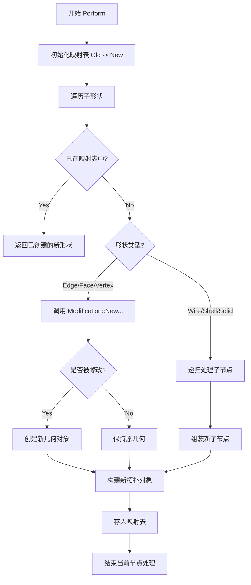
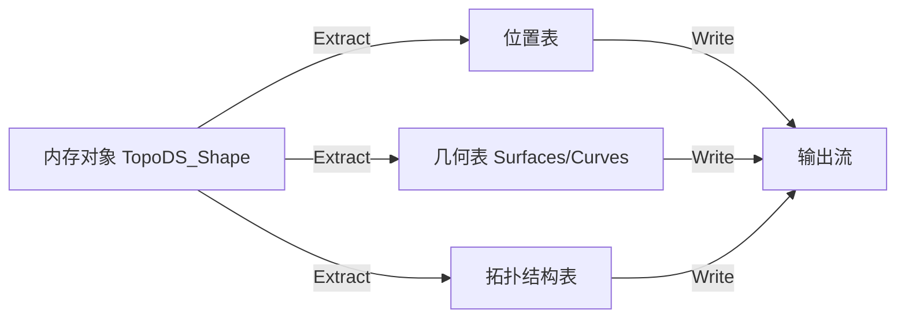

# BRepTools 详细设计文档

本文档深入解析 `BRepTools` 模块中关键组件的算法流程、数据结构设计以及函数接口说明。

## 1. 几何修改引擎 (BRepTools_Modifier)

### 1.1 设计概述
`BRepTools_Modifier` 是一个通用的形状重建引擎，它遍历输入的拓扑结构，根据 `BRepTools_Modification` 定义的规则生成新的几何体，并重建拓扑关系。核心难点在于**保持拓扑共享性**（即原模型中共享的边，在修改后仍应保持共享）。

### 1.2 核心算法流程
算法采用**深度优先遍历 (DFS)** 配合 **哈希映射 (HashMap)** 来处理拓扑重建。

### 1.3 数据结构
*   **映射表 (`myMap`)**: `TopTools_DataMapOfShapeShape`
    *   **Key**: 原始形状 (Original Shape)
    *   **Value**: 修改后的形状 (Modified Shape)
    *   **作用**: 保证如果边 E 在面 F1 和 F2 中共享，那么处理 F2 时会直接复用处理 F1 时生成的 E'，而不是重新生成一个 E''。

### 1.4 关键函数接口说明

#### `Perform`
*   **功能**: 执行修改操作。
*   **输入参数**:
    *   `M`: `Handle(BRepTools_Modification)` - 定义具体的几何修改策略。
    *   `theProgress`: `Message_ProgressRange` - 进度条指示器（可选）。
*   **输出参数**: 无（修改结果存储在内部状态中）。

#### `ModifiedShape`
*   **功能**: 查询某个原始形状对应的修改后形状。
*   **输入参数**:
    *   `S`: `TopoDS_Shape` - 原始形状。
*   **输出参数**:
    *   `TopoDS_Shape` - 修改后的形状。如果形状被删除则返回 Null，如果未改变则返回原形状（取决于实现细节，通常是新引用的原对象）。

---

## 2. 几何修改策略接口 (BRepTools_Modification)

### 2.1 设计概述
这是所有具体修改算法必须实现的抽象基类。它将“如何修改”与“如何遍历”解耦。

### 2.2 接口说明

#### `NewSurface` (虚函数)
*   **功能**: 定义面的修改规则。
*   **输入参数**:
    *   `F`: `TopoDS_Face` - 待处理的面。
*   **输出参数**:
    *   `S`: `Handle(Geom_Surface)&` - 新的曲面几何。
    *   `L`: `TopLoc_Location&` - 新的位置变换。
    *   `Tol`: `Standard_Real&` - 新的容差值。
    *   `RevWires`: `Standard_Boolean&` - 是否需要反转线框（当曲面法向改变时）。
    *   `RevFace`: `Standard_Boolean&` - 是否反转面的朝向。
*   **返回值**: `Standard_Boolean` - 如果面被修改返回 True，否则返回 False。

#### `NewCurve` (虚函数)
*   **功能**: 定义边的 3D 曲线修改规则。
*   **输入参数**:
    *   `E`: `TopoDS_Edge` - 待处理的边。
*   **输出参数**:
    *   `C`: `Handle(Geom_Curve)&` - 新的 3D 曲线。
    *   `L`: `TopLoc_Location&` - 新的位置变换。
    *   `Tol`: `Standard_Real&` - 新的容差值。
*   **返回值**: `Standard_Boolean` - 如果边被修改返回 True。

---

## 3. 轮廓线遍历器 (BRepTools_WireExplorer)

### 3.1 业务逻辑
`TopoDS_Wire` 内部的边存储是无序的。`WireExplorer` 旨在提供一个按几何连接顺序（v1->e1->v2->e2->v3...）的遍历器。

### 3.2 算法逻辑
1.  **初始化**: 构建一个映射表，将每个顶点映射到连接该顶点的边列表。
2.  **起始点选择**: 如果线是不闭合的，寻找度数为 1 的顶点作为起点。
3.  **步进 (Next)**:
    *   获取当前边的终点 Vertex_Current。
    *   在映射表中查找连接到 Vertex_Current 的所有边。
    *   排除掉刚刚遍历过的边。
    *   选择下一条边，并更新当前方向。

### 3.3 数据结构
*   **连接图**: `TopTools_DataMapOfShapeListOfShape`
    *   **Key**: `TopoDS_Vertex`
    *   **Value**: `TopTools_ListOfShape` (Edges list)

### 3.4 接口说明

#### `Init`
*   **功能**: 初始化遍历器。
*   **输入参数**:
    *   `W`: `TopoDS_Wire` - 要遍历的线框。
    *   `F`: `TopoDS_Face` (可选) - 所在的参考面，用于确定 2D 参数空间中的连接性。

#### `Next`
*   **功能**: 移动到下一条边。
*   **前置条件**: `More()` 为 True。

#### `Current`
*   **功能**: 获取当前边。
*   **返回值**: `TopoDS_Edge`。

#### `Orientation`
*   **功能**: 获取当前边在遍历路径上的方向（Forward/Reversed）。注意这可能与边在 Wire 中的存储方向不同，它代表的是“行走”方向。

---

## 4. 形状集合持久化 (BRepTools_ShapeSet)

### 4.1 数据流图
文件格式采用了分段式的设计，确保数据引用的紧凑性。

### 4.2 关键设计
*   **引用机制**: 拓扑结构部分不直接存储几何数据，而是存储一个整数索引（Index），指向几何表中的第 N 个几何体。
*   **位置优化**: 共享的位置变换只存储一次，通过索引引用。

### 4.3 接口说明

#### `Write`
*   **功能**: 将形状集合写入流。
*   **输入参数**:
    *   `OS`: `Standard_OStream&` - 输出流。
*   **流程**:
    1.  调用 `WriteGeometry` 写入所有引用的曲面、曲线。
    2.  调用 `WritePolygon` 写入多边形网格（如有）。
    3.  递归遍历拓扑树，写入 TShape 记录（类型、标志位、几何索引）。

#### `Read`
*   **功能**: 从流中读取形状集合。
*   **输入参数**:
    *   `IS`: `Standard_IStream&` - 输入流。
*   **流程**: 与 Write 相反，先读取几何表建立索引数组，再解析拓扑结构并链接几何对象。
