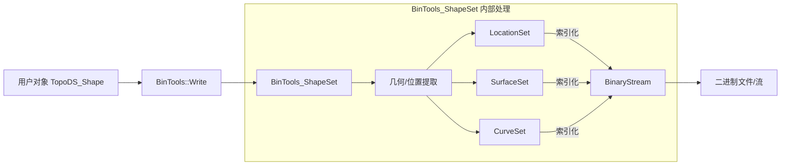
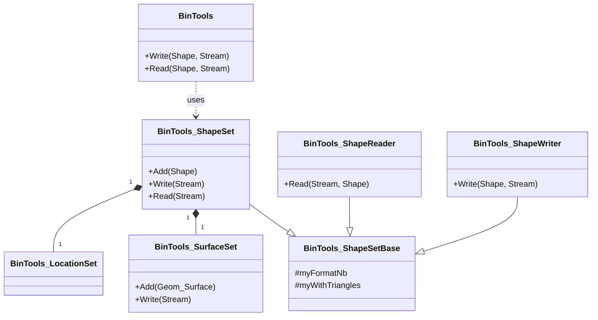
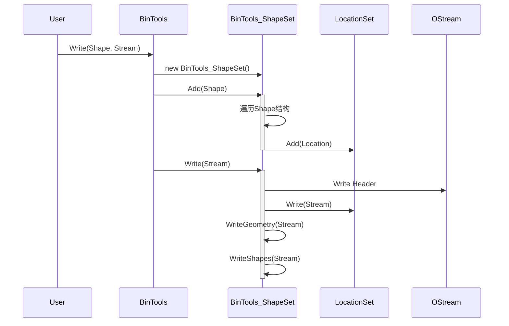

# BinTools 技术架构与详细设计

## 1. 总体架构设计
BinTools 模块采用了**分层架构**设计，底层依赖于 OCCT 的基础数据类型和流处理机制，上层提供面向对象的序列化服务。

*   **接口层 (API Layer)**: `BinTools` 类提供静态入口方法，简化用户调用。
*   **逻辑层 (Logic Layer)**:
    *   **集合管理 (Set Management)**: `BinTools_ShapeSet` 及其辅助类 (`CurveSet`, `SurfaceSet` 等) 实现了基于“对象池”的序列化策略。
    *   **流式处理 (Streaming Logic)**: `BinTools_ShapeReader` / `Writer` 实现了基于引用的流式策略。
*   **数据访问层 (Data Access Layer)**: `BinTools_IStream` / `OStream` 封装了底层的字节流操作，处理字节序和基础类型转换。

## 2. 关键算法与流程设计

### 2.1 形状写入算法 (Shape Writing Algorithm)
以 `BinTools_ShapeSet::Write` 为例：

1.  **初始化**: 创建各几何类型的集合 (SurfaceSet, CurveSet, PolygonSet)。
2.  **遍历 (Traversal)**: 遍历输入的 `TopoDS_Shape` 及其所有子形状。
    *   对于每个面 (Face)，提取其几何曲面加入 `SurfaceSet`。
    *   对于每个边 (Edge)，提取其 3D 曲线加入 `CurveSet`，提取其 2D 曲线加入 `Curve2dSet`。
    *   提取位置变换加入 `LocationSet`。
3.  **去重与索引 (Indexing)**: `Set` 类内部使用 `IndexedMap` 数据结构。当添加新对象时，检查是否存在；若存在返回已有索引，否则分配新索引。
4.  **写入阶段 (Writing Phase)**:
    *   **Header**: 写入版本号和魔数。
    *   **Locations**: 调用 `LocationSet::Write`，序列化所有变换矩阵。
    *   **Geometry**: 依次调用 `SurfaceSet::Write`, `CurveSet::Write` 等，写入所有几何定义。
    *   **Shapes**: 按照深度优先或特定顺序写入拓扑结构。对于每个拓扑实体，写入其类型（COMPOUND, SOLID, FACE...）、方向（FORWARD, REVERSED...）以及引用的几何索引和位置索引。

### 2.2 形状读取算法 (Shape Reading Algorithm)
以 `BinTools_ShapeSet::Read` 为例：

1.  **读取头信息**: 验证格式版本。
2.  **重建表 (Table Reconstruction)**:
    *   读取 `LocationSet`，在内存中生成 `TopLoc_Location` 对象数组。
    *   读取 `SurfaceSet`, `CurveSet` 等，生成对应的 `Geom_Surface`, `Geom_Curve` 对象数组。
3.  **重建拓扑 (Topology Reconstruction)**:
    *   读取形状结构树。
    *   当遇到引用（如“使用索引为 5 的曲面”），从之前的对象数组中直接获取指针。
    *   使用 `BRep_Builder` 构建最终的 `TopoDS_Shape` 对象。

## 3. 数据流图 (Data Flow Diagram)

## 4. 类图 (Class Diagram - 简化版)

## 5. 关键函数接口说明

### 5.1 BinTools::Write
*   **功能**: 将形状写入流的静态便捷接口。
*   **输入参数**:
    *   `const TopoDS_Shape& theShape`: 要写入的拓扑形状。
    *   `Standard_OStream& theStream`: 目标输出流。
    *   `const Standard_Boolean theWithTriangles`: 是否保存三角剖分数据（用于显示）。
    *   `const Standard_Boolean theWithNormals`: 是否保存法线数据。
    *   `const BinTools_FormatVersion theVersion`: 使用的二进制格式版本。
*   **输出参数**: 无（通过流输出）。

### 5.2 BinTools_ShapeSet::Add
*   **功能**: 将形状及其子形状添加到集合中，进行预处理和索引。
*   **输入参数**:
    *   `const TopoDS_Shape& S`: 要添加的形状。
*   **输出参数**:
    *   `Standard_Integer`: 返回该形状在集合中的索引号。

### 5.3 BinTools_ShapeSet::Write
*   **功能**: 执行实际的序列化操作，将所有收集到的数据写入流。
*   **输入参数**:
    *   `Standard_OStream& OS`: 输出流。
*   **输出参数**: 无。

### 5.4 BinTools_IStream::ReadReal
*   **功能**: 从二进制流中读取一个双精度浮点数。
*   **输入参数**: 无（使用内部持有的流）。
*   **输出参数**:
    *   `Standard_Real`: 读取到的浮点数值。

## 6. 数据结构设计
*   **索引映射 (Indexed Maps)**: 核心数据结构是 `TColStd_IndexedMapOfTransient` (在各个 Set 类中使用)。它结合了哈希表和数组的特性，既能通过对象快速查找索引（O(1)），也能通过索引快速获取对象（O(1)），完美满足去重和序列化的需求。
*   **字节流格式**:
    *   **标识符 (Byte)**: 使用 1 字节标记对象类型（如 `BinTools_ObjectType` 定义）。
    *   **变长数据**: 虽然大部分数据是定长的，但在新版 Reader/Writer 中支持变长引用，根据引用ID的大小选择 8bit, 16bit, 32bit 或 64bit 存储，优化空间。

## 7. 时序图 (Sequence Diagram - 写入过程)

