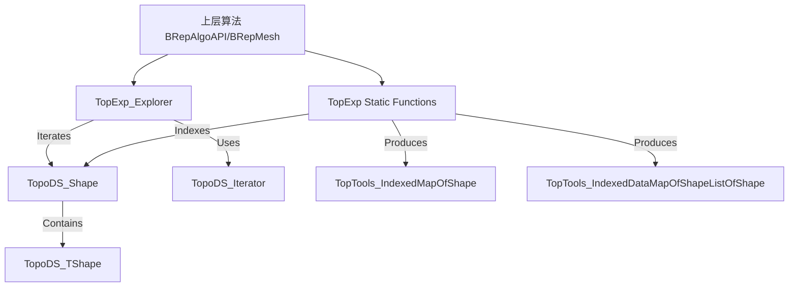

# TopExp 业务功能与技术架构详�?

本文档详细阐述了 Open CASCADE Technology (OCCT) �?`TopExp` 模块的业务功能定位及其技术架构设计�?

## 1. 业务功能 (Business Function)

`TopExp` (Topology Exploration) �?OCCT 建模数据模块中的基础组件，专注于**拓扑结构的访问与分析**。它不涉及几何计算或形状修改，而是作为连接底层数据结构与上层算法的“导航员”�?

### 1.1 拓扑元素提取
*   **功能描述**：提供从复杂形状中提取特定类型子形状的能力�?
*   **应用场景**�?
    *   统计模型中包含多少个面（Faces）、边（Edges）或顶点（Vertices）�?
    *   获取一�?Solid 的所�?Face 以进行网格划分或渲染�?
    *   获取一�?Wire 的所�?Edge 以进行长度计算�?
*   **核心组件**：`TopExp_Explorer`�?

### 1.2 拓扑关系映射 (Map Shapes)
*   **功能描述**：将形状的层级结构扁平化，存储到索引映射表（IndexedMap）中�?
*   **应用场景**�?
    *   为形状中的每个子元素分配唯一的整�?ID（索引）�?
    *   去重操作：由于拓扑结构的共享性，同一�?Edge 可能在多�?Face 中出现。`MapShapes` 能够保证每个唯一�?Edge 只被记录一次�?
*   **核心组件**：`TopExp::MapShapes`�?

### 1.3 祖先关系查询 (Ancestors)
*   **功能描述**：建立从“子形状”到“父形状”的反向索引。标准拓扑结构只存储了“父->子”的引用，`TopExp` 能够动态计算反向关系�?
*   **应用场景**�?
    *   **邻接查询**：给定一条边，找出共享这条边的两个面（Winged-Edge 结构的模拟）�?
    *   **连接性分�?*：查找连接到某个顶点的所有边�?
*   **核心组件**：`TopExp::MapShapesAndAncestors`�?

---

## 2. 技术架�?(Technical Architecture)

`TopExp` 位于 `TopoDS`（拓扑数据结构）之上，为所有需要访�?BRep 结构的算法提供统一入口�?

### 2.1 模块依赖
*   **底层依赖**：`Standard`（基础类型）、`TopoDS`（拓扑定义，�?Shape, Edge, Face）、`TopAbs`（拓扑枚举类型）、`TopTools`（容器类）�?
*   **上层支持**：几乎所有高级建模算法（`BRepAlgoAPI`, `BRepOffset`, `BRepMesh`）都依赖 `TopExp` 来遍历输入数据�?

### 2.2 核心设计模式

#### 2.2.1 迭代器模�?(Iterator Pattern)
`TopExp_Explorer` 是对 `TopoDS_Iterator` 的高级封装�?
*   **`TopoDS_Iterator`**：只能遍历直接子节点（一层）�?
*   **`TopExp_Explorer`**：实现了**深度优先搜索 (DFS)** 算法，能够穿透多层结构，直接查找后代节点。它通过维护一个内部堆栈（Stack）来管理遍历路径�?

#### 2.2.2 过滤器模�?(Filter Pattern)
`TopExp_Explorer` 支持“查找类型”和“避开类型”的过滤机制�?
*   **ToFind**: 用户感兴趣的形状类型（如 FACE）�?
*   **ToAvoid**: 遍历路径中禁止进入的容器类型（如 SHELL）�?
*   **机制**: 如果当前节点的类型等�?`ToAvoid`，则不继续向下递归，直接跳过该分支�?

#### 2.2.3 索引映射 (Indexing/Mapping)
`TopExp` 利用 `TopTools` 提供的哈希映射容器（IndexedMap, DataMap）来存储拓扑对象�?
*   **哈希键�?*: 使用 `TopoDS_Shape` 的哈希值（基于 TShape 指针�?Location）来快速识别相同或不同的拓扑元素�?
*   **空间换时�?*: 通过预先构建 Ancestors Map，将原本需要全图遍历的邻接查询操作复杂度降低为 O(1)�?

### 2.3 架构图示

### 2.4 关键数据�?
1.  **遍历流程**：用户初始化 `Explorer(Shape, Type)` -> Explorer 压入根节�?-> 循环：弹�?-> 检查类�?-> 若匹配则返回 Current -> 若由子节点则将子节点压栈�?
2.  **映射流程**：用户调�?`MapShapes(S, M)` -> 递归遍历 S -> 将访问到的每个子形状插入 M（自动去重） -> 结束�?
