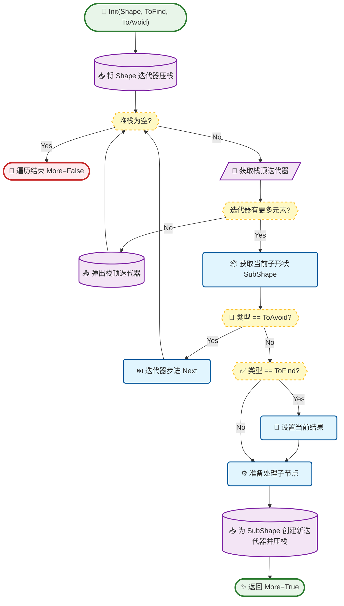
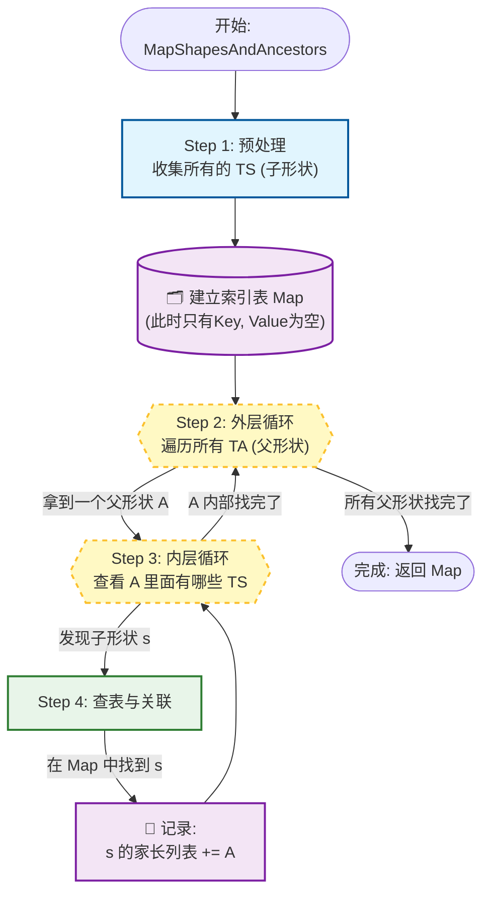
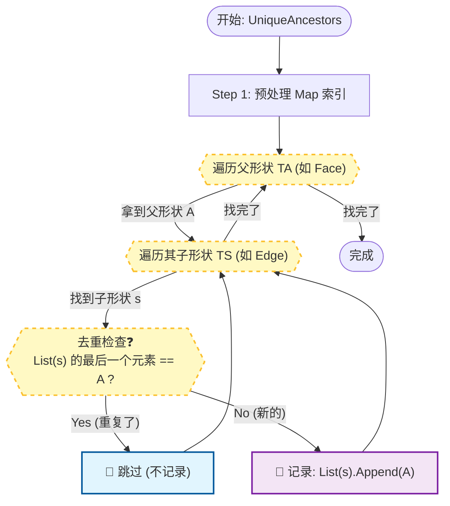

# TopExp 详细设计文档

本文档深入解析 `TopExp` 模块中关键组件的算法流程、数据结构设计以及函数接口说明。

## 1. 深度优先遍历器 (TopExp_Explorer)

### 1.1 算法流程设计
`TopExp_Explorer` 使用非递归的方式实现深度优先搜索（DFS），避免了在深层拓扑结构中可能导致的栈溢出问题。它维护一个显式的堆栈（Stack）。

### 1.2 数据结构
*   **`myStack`**: `TopExp_Stack` (即 `TopoDS_Iterator*` 的链表或数组)。
    *   存储当前遍历路径上每一层的迭代器。
*   **`myShape`**: `TopoDS_Shape`
    *   当前找到的符合条件的形状。
*   **`toFind`**: `TopAbs_ShapeEnum`
    *   目标形状类型。
*   **`toAvoid`**: `TopAbs_ShapeEnum`
    *   避开形状类型。

### 1.3 接口说明

#### `Init`
*   **功能**: 初始化遍历器。
*   **输入参数**:
    *   `S`: `TopoDS_Shape` - 根形状。
    *   `ToFind`: `TopAbs_ShapeEnum` - 要查找的子形状类型。
    *   `ToAvoid`: `TopAbs_ShapeEnum` (默认 `SHAPE`) - 遇到此类型停止向下递归。

#### `More`
*   **功能**: 检查是否还有更多符合条件的形状。
*   **返回值**: `Standard_Boolean`。

#### `Next`
*   **功能**: 继续搜索下一个形状。
*   **逻辑**: 驱动内部堆栈进行下一步 DFS 搜索，直到找到下一个匹配项或堆栈清空。

#### `Current`
*   **功能**: 获取当前找到的形状。
*   **返回值**: `const TopoDS_Shape&`。

---

## 2. 拓扑映射工具 (TopExp Package Methods)

### 2.1 MapShapes (扁平化映射)

#### 算法逻辑
递归遍历给定的形状 `S`。对于访问到的每一个子形状，将其添加到一个 `IndexedMap` 中。`IndexedMap` 会自动处理去重（通过哈希值）。

#### 接口说明
*   **功能**: 将形状 `S` 中的所有子形状（或指定类型的子形状）存储到 `M` 中。
*   **输入参数**:
    *   `S`: `TopoDS_Shape` - 待处理形状。
    *   `T`: `TopAbs_ShapeEnum` (可选) - 仅映射此类型的子形状。
*   **输出参数**:
    *   `M`: `TopTools_IndexedMapOfShape&` - 结果容器。索引从 1 开始。

### 2.2 MapShapesAndAncestors (祖先映射)

#### 算法逻辑
这是一个两层遍历算法：
1.  首先调用 `MapShapes` 收集所有类型为 `TS` (SubShape Type) 的形状，建立索引。
2.  然后使用 `TopExp_Explorer` 遍历 `S` 查找类型为 `TA` (Ancestor Type) 的形状（例如 Face）。
3.  对于找到的每个 Ancestor `A`，再使用 `TopExp_Explorer` 遍历其内部类型为 `TS` 的子形状 `s`。
4.  在 Map 中查找 `s`，将 `A` 添加到 `s` 对应的 Ancestor 列表中。

#### 接口说明

*   **功能**: 建立从“子形状”到“祖先形状”的映射。例如，查找每条边被哪些面使用。
*   **输入参数**:
    *   `S`: `TopoDS_Shape` - 范围形状。
    *   `TS`: `TopAbs_ShapeEnum` - 子形状类型（Key）。
    *   `TA`: `TopAbs_ShapeEnum` - 祖先形状类型（Value List 中的元素）。
*   **输出参数**:
    *   `M`: `TopTools_IndexedDataMapOfShapeListOfShape&` - 结果容器。Key 是 TS 类型的形状，Value 是 TA 类型的形状列表。

### 2.3 MapShapesAndUniqueAncestors

#### 业务差异
与 `MapShapesAndAncestors` 类似，但强调**唯一性**。如果一个 Ancestor `A` 多次包含同一个子形状 `s`（例如一条缝合边在同一个面中出现两次），在普通 Ancestors Map 中 `A` 会出现两次。而在 UniqueAncestors Map 中，`A` 只会被记录一次。

#### 接口说明
*   **功能**: 建立子形状到唯一祖先形状的映射。
*   **输入/输出参数**: 同上。
*   **逻辑**: 在添加 `A` 到列表前，检查列表末尾是否已经等于 `A`，或者使用 Set 进行去重。

