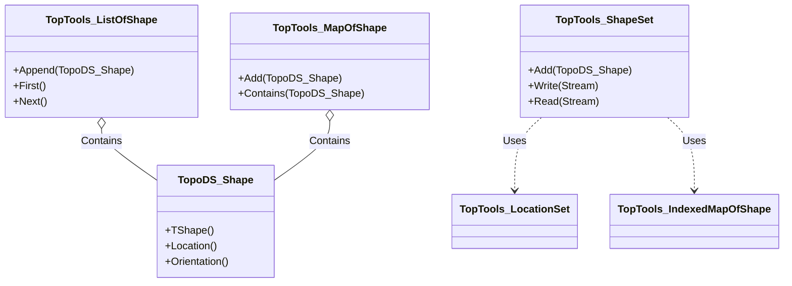
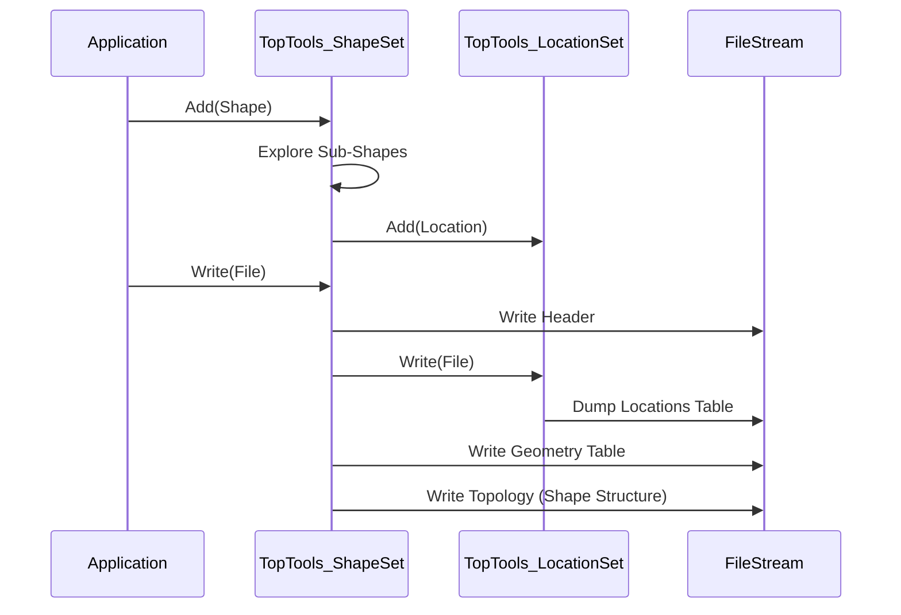

# OCCT Technical Architecture and Design

## 1. System Architecture
Open CASCADE Technology follows a layered architecture. `TopTools` resides in the **Modeling Data** layer.

### Layered Structure
1.  **Foundation Classes (TKKernel)**: Basic types, memory management, standard containers (`TCollection`, `NCollection`), math libraries.
2.  **Modeling Data (TKBRep)**: Defines the data structures for 3D modeling.
    *   **TopoDS**: Defines the abstract topological shapes (Shape, Face, Edge, etc.).
    *   **TopLoc**: Manages local coordinate systems (locations).
    *   **TopTools**: **(Current Package)** Provides concrete collections (Lists, Maps) for `TopoDS` objects.
3.  **Modeling Algorithms (TKPrim, TKBool, etc.)**: Algorithms that modify the data (Boolean operations, Sweeps, Offsets).
4.  **Visualization (TKService, TKV3d)**: Displaying the data.
5.  **Data Exchange (TKSTEP, TKIGES)**: Importing/Exporting to other formats.

## 2. Design Patterns & Algorithms

### 2.1 Template Instantiation (Generic Programming)
`TopTools` heavily relies on C++ templates (macros in older OCCT versions, templates in newer).
- **Concept**: Instead of writing a new List class for every data type, OCCT uses `NCollection_List<T>`.
- **Implementation**: `TopTools_ListOfShape` is essentially `typedef NCollection_List<TopoDS_Shape> TopTools_ListOfShape;`.
- **Benefit**: Reduces code duplication and ensures performance consistent with the core collection library.

### 2.2 Hashing Strategy (`TopTools_ShapeMapHasher`)
To store Shapes in a Hash Map (`DataMap` or `Map`), a hash code is required.
- **Algorithm**: The hash is computed based on:
    1.  **Address** of the underlying TShape (the geometry container).
    2.  **Location** (transformation matrix).
    3.  **Orientation** (Forward/Reversed) - *Only for Oriented Maps*.
- **Key Insight**: Two shapes are "equal" in a map if they share the same geometry and location. This allows efficient de-duplication of shared boundaries in B-Rep models.

### 2.3 Serialization Algorithm (`ShapeSet`)
The `ShapeSet::Write` and `Read` methods implement a recursive serialization algorithm.
- **Process**:
    1.  **Dump Locations**: Extract all unique coordinate systems (`LocationSet`) and write them to a table.
    2.  **Dump Geometry**: Extract all 3D Curves and Surfaces and write them.
    3.  **Dump Topology**:
        - Iterate through the Shape.
        - Write the Shape type (e.g., SOLID).
        - Write flags (Free, Modified, etc.).
        - Recursively call Write for each sub-shape (children).
        - Use pointers/indices to reference the previously written Locations and Geometry.

## 3. Function Interface Description (API)

### 3.1 TopTools_ShapeSet
**Class for managing persistence of shapes.**

#### `Standard_Integer Add(const TopoDS_Shape& S)`
- **Function**: Adds a shape and all its sub-shapes to the set to be written.
- **Input**: `S` (TopoDS_Shape) - The shape to add.
- **Output**: Returns the integer index of the added shape.
- **Logic**: Traverses `S` recursively. If a sub-shape is already in the map, it returns the existing index (deduplication).

#### `void Write(Standard_OStream& OS)`
- **Function**: Writes the content of the set to a stream.
- **Input**: `OS` (Standard_OStream) - The output stream (file).
- **Output**: None (Writes to stream).
- **Logic**: Writes Locations section, then Geometry section, then Topology section.

#### `void Read(Standard_IStream& IS)`
- **Function**: Reads the content from a stream.
- **Input**: `IS` (Standard_IStream) - The input stream.
- **Output**: None (Populates the internal structures).

### 3.2 TopTools_ShapeMapHasher
**Helper for hashing shapes.**

#### `static Standard_Integer HashCode(const TopoDS_Shape& S, const Standard_Integer Upper)`
- **Function**: Computes a hash code for a shape.
- **Input**:
    - `S`: The shape to hash.
    - `Upper`: The upper bound for the hash value (bucket count).
- **Output**: Integer hash value between 1 and `Upper`.

#### `static Standard_Boolean IsEqual(const TopoDS_Shape& S1, const TopoDS_Shape& S2)`
- **Function**: Checks if two shapes are identical for map storage.
- **Input**: `S1`, `S2` - Shapes to compare.
- **Output**: Boolean (True if equal).
- **Logic**: Checks if `TShape` pointers match and `Location` objects match.

## 4. Key Diagrams (Conceptual)

### Class Diagram

### Data Flow: Saving a Shape

