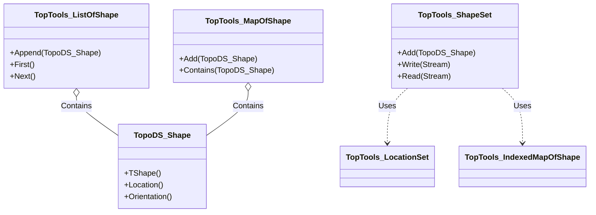
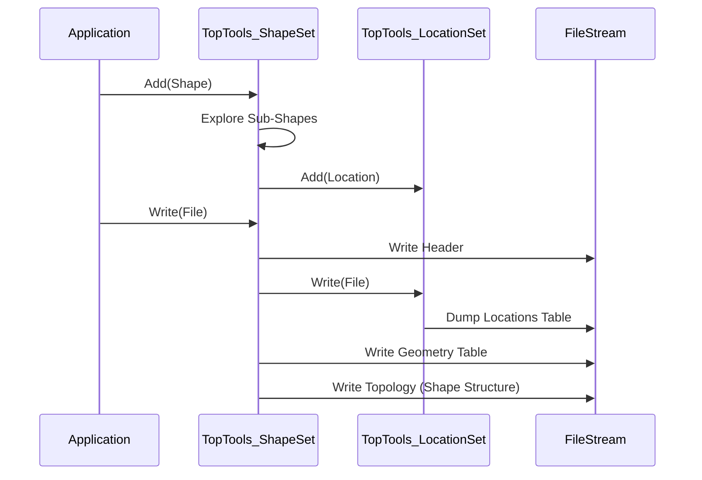

# OCCT 技术架构与设计

## 1. 系统架构
Open CASCADE Technology 遵循分层架构。`TopTools` 位于 **Modeling Data (建模数据)** 层。

### 分层结构
1.  **Foundation Classes (TKKernel)**: 基本类型、内存管理、标准容器 (`TCollection`, `NCollection`)、数学库。
2.  **Modeling Data (TKBRep)**: 定义 3D 建模的数据结构。
    *   **TopoDS**: 定义抽象拓扑形状（Shape, Face, Edge 等）。
    *   **TopLoc**: 管理局部坐标系（位置）。
    *   **TopTools**: **(当前包)** 为 `TopoDS` 对象提供具体集合（Lists, Maps）。
3.  **Modeling Algorithms (TKPrim, TKBool, etc.)**: 修改数据的算法（布尔运算、扫掠、偏移）。
4.  **Visualization (TKService, TKV3d)**: 显示数据。
5.  **Data Exchange (TKSTEP, TKIGES)**: 导入/导出为其他格式。

## 2. 设计模式与算法

### 2.1 模板实例化 (泛型编程)
`TopTools` 严重依赖 C++ 模板（旧版本 OCCT 中为宏，新版本为模板）。
- **概念**: OCCT 使用 `NCollection_List<T>`，而不是为每种数据类型编写新的 List 类。
- **实现**: `TopTools_ListOfShape` 本质上是 `typedef NCollection_List<TopoDS_Shape> TopTools_ListOfShape;`。
- **优点**: 减少代码重复，并确保性能与核心集合库一致。

### 2.2 哈希策略 (`TopTools_ShapeMapHasher`)
为了将形状存储在哈希映射（`DataMap` 或 `Map`）中，需要哈希码。
- **算法**: 哈希计算基于：
    1.  底层 TShape（几何容器）的 **地址 (Address)**。
    2.  **位置 (Location)** (变换矩阵)。
    3.  **方向 (Orientation)** (Forward/Reversed) - *仅适用于定向映射 (Oriented Maps)*。
- **关键见解**: 如果两个形状共享相同的几何和位置，则它们在映射中是“相等”的。这允许在 B-Rep 模型中高效地对共享边界进行去重。

### 2.3 序列化算法 (`ShapeSet`)
`ShapeSet::Write` 和 `Read` 方法实现了递归序列化算法。
- **流程**:
    1.  **转储位置 (Dump Locations)**: 提取所有唯一的坐标系（`LocationSet`）并将它们写入表。
    2.  **转储几何 (Dump Geometry)**: 提取所有 3D 曲线和曲面并写入它们。
    3.  **转储拓扑 (Dump Topology)**:
        - 遍历 Shape。
        - 写入 Shape 类型（例如，SOLID）。
        - 写入标志（Free, Modified 等）。
        - 递归调用 Write 以处理每个子形状（子级）。
        - 使用指针/索引引用先前写入的位置和几何。

## 3. 功能接口描述 (API)

### 3.1 TopTools_ShapeSet
**用于管理形状持久化的类。**

#### `Standard_Integer Add(const TopoDS_Shape& S)`
- **功能**: 将形状及其所有子形状添加到集合中以进行写入。
- **输入**: `S` (TopoDS_Shape) - 要添加的形状。
- **输出**: 返回已添加形状的整数索引。
- **逻辑**: 递归遍历 `S`。如果子形状已在映射中，则返回现有索引（去重）。

#### `void Write(Standard_OStream& OS)`
- **功能**: 将集合的内容写入流。
- **输入**: `OS` (Standard_OStream) - 输出流（文件）。
- **输出**: 无（写入流）。
- **逻辑**: 写入位置部分，然后是几何部分，然后是拓扑部分。

#### `void Read(Standard_IStream& IS)`
- **功能**: 从流中读取内容。
- **输入**: `IS` (Standard_IStream) - 输入流。
- **输出**: 无（填充内部结构）。

### 3.2 TopTools_ShapeMapHasher
**用于哈希形状的助手。**

#### `static Standard_Integer HashCode(const TopoDS_Shape& S, const Standard_Integer Upper)`
- **功能**: 计算形状的哈希码。
- **输入**:
    - `S`: 要哈希的形状。
    - `Upper`: 哈希值（桶计数）的上限。
- **输出**: 1 到 `Upper` 之间的整数哈希值。

#### `static Standard_Boolean IsEqual(const TopoDS_Shape& S1, const TopoDS_Shape& S2)`
- **功能**: 检查两个形状是否相同以进行映射存储。
- **输入**: `S1`, `S2` - 要比较的形状。
- **输出**: 布尔值（如果相等则为 True）。
- **逻辑**: 检查 `TShape` 指针是否匹配以及 `Location` 对象是否匹配。

## 4. 关键图表 (概念性)

### 类图

### 数据流: 保存形状

