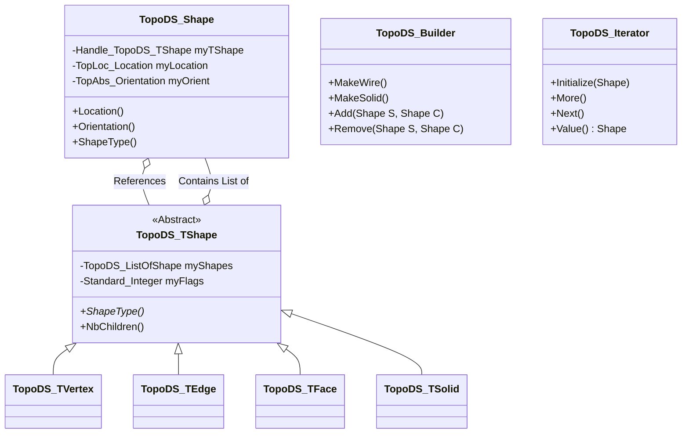

# TopoDS 技术架构与设计

## 1. 架构设计模式：Handle/Body (句柄/实体)

TopoDS 采用了 **Handle/Body** 模式（也称为 Bridge 模式或 Flyweight 模式的变体）。

*   **Handle (`TopoDS_Shape`)**:
    *   **值语义**：可以像 `int` 一样被拷贝，开销极小。
    *   **包含**：
        *   `Handle(TopoDS_TShape)`: 指向底层数据的智能指针。
        *   `TopLoc_Location`: 自身的局部坐标变换。
        *   `TopAbs_Orientation`: 自身的方向（FORWARD, REVERSED 等）。
    *   **职责**：作为用户操作的接口，处理位置和方向的叠加。

*   **Body (`TopoDS_TShape`)**:
    *   **引用语义**：通过引用计数管理生命周期。
    *   **包含**：
        *   `TopoDS_ListOfShape`: 子形状列表（树状结构）。
        *   标志位（Flags）：如 `Free`, `Modified`, `Checked`, `Closed` 等。
    *   **职责**：存储实际的拓扑结构关系。

### 类图 (Class Diagram)

## 2. 核心数据结构：拓扑树 (Topological Tree)

TopoDS 数据结构本质上是一个**有向无环图 (DAG)**，通常表现为树状结构，但允许节点共享。

*   **Compound** (包含) -> Solids
*   **Solid** (包含) -> Shells
*   **Shell** (包含) -> Faces
*   **Face** (包含) -> Wires
*   **Wire** (包含) -> Edges
*   **Edge** (包含) -> Vertices

**数据流图示例 (Data Flow)**:
当我们在 Solid 上调用迭代器时：
`Solid` -> `Iterator` -> 获取 `Shell` (应用 Solid 的 Location) -> `Iterator` -> 获取 `Face` (叠加 Shell 的 Location) ...

## 3. 关键算法与函数接口说明

以下是系统中关键模块的设计环节函数接口说明。

### 3.1 形状构建：`TopoDS_Builder`

这是构建拓扑结构的唯一入口（除了特定的 BRep API）。

#### 接口：`Add`
*   **功能**：将一个子形状（Component）添加到父形状（Shape）中。
*   **输入参数**：
    *   `TopoDS_Shape& S`: 父形状（必须是可修改的，即 `Free` 状态）。
    *   `const TopoDS_Shape& C`: 要添加的子形状。
*   **输出参数**：无（通过修改 `S` 实现）。
*   **逻辑**：
    1. 检查 `S` 是否被冻结（Frozen），如果是则抛出异常。
    2. 检查 `S` 和 `C` 的类型兼容性（例如，不能把 Face 加到 Edge 里）。
    3. 将 `C` 存储到 `S` 对应的 `TShape` 的列表中。

#### 接口：`MakeCompound`, `MakeSolid`, etc.
*   **功能**：创建一个空的特定类型的拓扑容器。
*   **输入参数**：
    *   `TopoDS_Compound& C`: (引用) 待初始化的形状对象。
*   **输出参数**：`C` 被初始化为一个新的、空的 Compound。

### 3.2 形状遍历：`TopoDS_Iterator`

用于访问形状内部结构的算法。

#### 接口：`Initialize`
*   **功能**：初始化迭代器以遍历形状 `S`。
*   **输入参数**：
    *   `const TopoDS_Shape& S`: 要遍历的形状。
    *   `cumOri` (Boolean): 是否累加方向（默认 True）。
    *   `cumLoc` (Boolean): 是否累加位置（默认 True）。
*   **逻辑**：获取 `S` 的 `TShape` 中的子形状列表，准备遍历。

#### 接口：`Value`
*   **功能**：获取当前迭代到的子形状。
*   **输出参数**：`const TopoDS_Shape&`: 返回当前的子形状。
*   **算法细节**：
    *   返回的形状不仅仅是列表中存储的形状。
    *   它的 **Location** = `父形状 Location` * `子形状自身 Location`。
    *   它的 **Orientation** = `父形状 Orientation` 组合 `子形状自身 Orientation`。

### 3.3 状态查询：`TopoDS_Shape`

#### 接口：`ShapeType`
*   **功能**：返回形状的拓扑类型。
*   **输出**：`TopAbs_ShapeEnum` (VERTEX, EDGE, WIRE, FACE, SHELL, SOLID, COMPSOLID, COMPOUND)。

#### 接口：`IsNull`
*   **功能**：检查形状是否为空（未初始化）。
*   **输出**：Boolean。

#### 接口：`Location` / `Moved`
*   **功能**：获取或应用坐标变换。
*   **逻辑**：`Moved` 不会修改原形状，而是返回一个新的 `TopoDS_Shape`，其指向相同的 `TShape`，但包含新的变换矩阵。