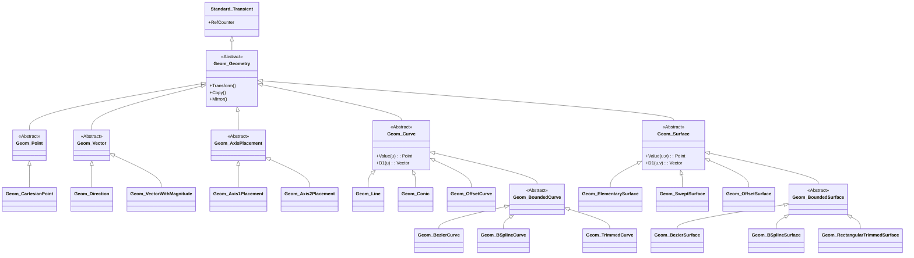
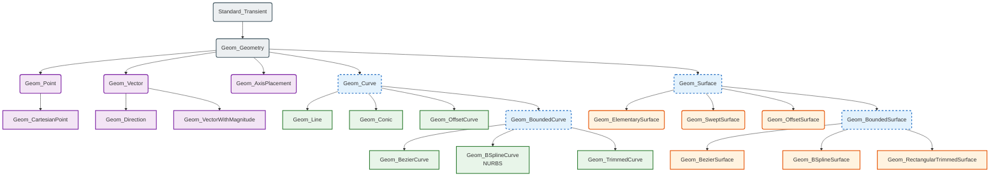
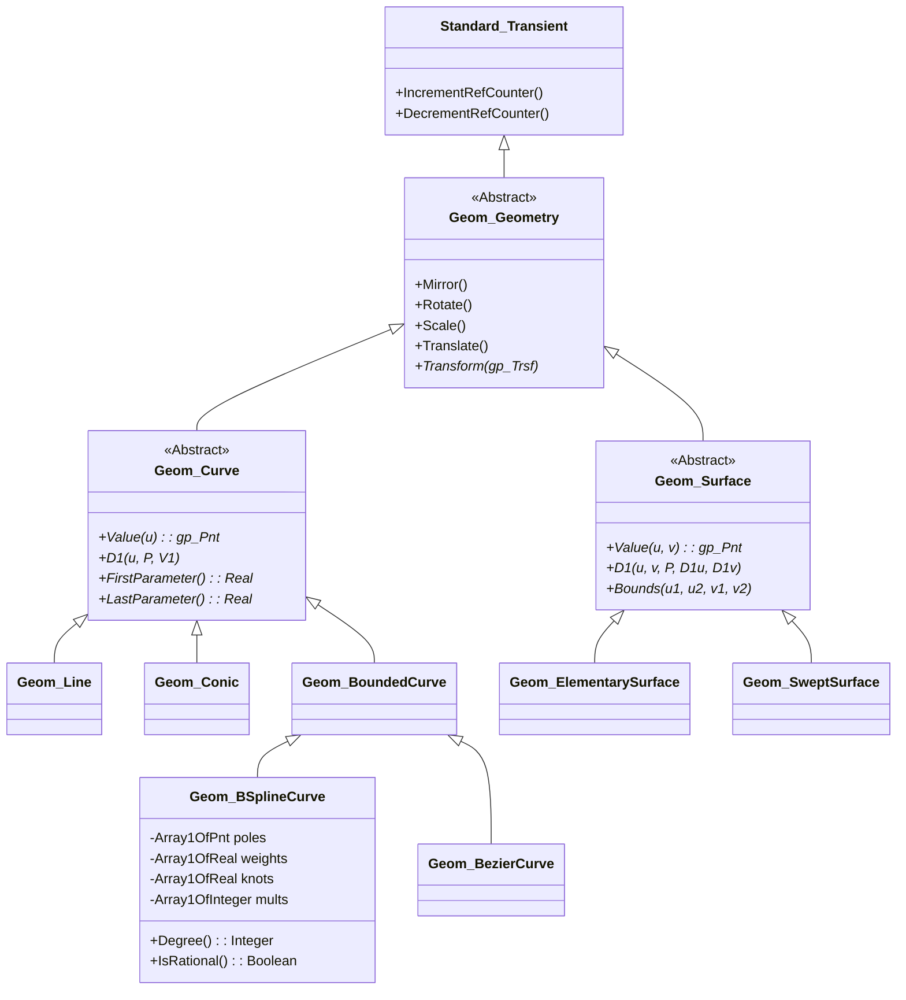

# OCCT Geom 包 - 设计与技术架构

## 1. 架构背景
`Geom` 包位于 OCCT 的 **ModelingData** 层。它与以下组件紧密交互：
*   **gp (Geometric Primitives / 几何图元)**：提供基础值类型（`gp_Pnt`, `gp_Vec`, `gp_Trsf`, `gp_Ax2`）作为 `Geom` 类的参数。
*   **Standard**：提供内存管理基类（`Standard_Transient`）和基本类型。
*   **TopoDS (Topology Data Structure / 拓扑数据结构)**：拓扑层（面、边）引用 `Geom` 对象来定义其几何形状。

## 2. 技术架构

### 2.1. 对象模型（继承层次结构）
架构遵循严格的面向对象层次设计。

*   **`Standard_Transient`**：所有引用计数对象的根基类。
    *   **`Geom_Geometry`**：所有 3D 几何体的抽象基类。定义了 `Transform` 接口。
        *   **`Geom_Point`**：抽象点。
            *   `Geom_CartesianPoint`
        *   **`Geom_Vector`**：抽象向量。
            *   `Geom_Direction`
            *   `Geom_VectorWithMagnitude`
        *   **`Geom_AxisPlacement`**：定位系统。
            *   `Geom_Axis1Placement` (点 + 方向)
            *   `Geom_Axis2Placement` (坐标系)
        *   **`Geom_Curve`**：抽象参数曲线 $C(u)$。
            *   `Geom_Line`
            *   `Geom_Conic` (圆, 椭圆, 双曲线, 抛物线)
            *   **`Geom_BoundedCurve`** (抽象有界曲线)
                *   `Geom_BezierCurve`
                *   `Geom_BSplineCurve` (NURBS)
                *   `Geom_TrimmedCurve`
            *   `Geom_OffsetCurve`
        *   **`Geom_Surface`**：抽象参数曲面 $S(u,v)$。
            *   `Geom_ElementarySurface` (平面, 圆柱, 球面, 圆锥, 环面)
            *   **`Geom_BoundedSurface`** (抽象有界曲面)
                *   `Geom_BezierSurface`
                *   `Geom_BSplineSurface`
                *   `Geom_RectangularTrimmedSurface`
            *   `Geom_SweptSurface` (旋转面, 线性拉伸面)
            *   `Geom_OffsetSurface`

### 2.2. 内存管理（Handle 架构）

OCCT 使用自定义的智能指针系统。
*   **句柄 (Handles)**：所有 `Geom` 对象都通过句柄操作（例如 `Handle(Geom_Curve)`）。
*   **瞬态 (Transient)**：类继承自 `Standard_Transient`，它维护引用计数。
*   **不可变性**：虽然 C++ 允许修改，但当几何体被拓扑共享时，通常被视为不可变以防止副作用，尽管 API 提供了修改器（例如 `SetPole`）。

### 2.3. 关注点分离
*   **几何 (Geometry) vs. 拓扑 (Topology)**：`Geom` 定义“形状”（无限圆柱、完整圆）。`TopoDS` 定义“边界”（裁剪面、边）。
*   **数据 (Data) vs. 算法 (Algorithms)**：`Geom` 包含数据和基本评估。复杂算法（求交、投影、布尔运算）位于单独的包（`GeomAPI`, `BRepAlgoAPI`）中，以保持数据层轻量化。

## 3. 类图 (Mermaid)

toolName: view_files
            
status: success
          
            
filePath: c:\Users\M2270\Desktop\OCCT\src\ModelingData\TKG3d\Geom\Geom_OsculatingSurface.hxx
          
这是一份完整的 `Geom` 包（位于 `src/ModelingData/TKG3d/Geom`）类图。我根据该目录下的实际文件结构，补全了点、向量、定位系统以及具体的曲线和曲面子类。

### 完整的 OCCT Geom 类图

```mermaid
classDiagram
    %% ---------------------------------------------------------
    %% 根类 (Root)
    %% ---------------------------------------------------------
    class Standard_Transient {
        +IncrementRefCounter()
        +DecrementRefCounter()
        +DynamicType()
    }

    %% ---------------------------------------------------------
    %% 几何体抽象基类 (Geometry Base)
    %% ---------------------------------------------------------
    class Geom_Geometry {
        <<Abstract>>
        +Mirror(P : gp_Pnt)
        +Rotate(A : gp_Ax1, Ang : Real)
        +Scale(P : gp_Pnt, S : Real)
        +Translate(V : gp_Vec)
        +Transform(T : gp_Trsf)
        +Copy()* : Geom_Geometry
    }
    Standard_Transient <|-- Geom_Geometry

    %% ---------------------------------------------------------
    %% 1. 点 (Points)
    %% ---------------------------------------------------------
    class Geom_Point {
        <<Abstract>>
        +Coord() : gp_Pnt
        +X() : Real
        +Y() : Real
        +Z() : Real
    }
    Geom_Geometry <|-- Geom_Point

    class Geom_CartesianPoint {
        +SetCoord(X, Y, Z)
        +SetPnt(P)
    }
    Geom_Point <|-- Geom_CartesianPoint

    %% ---------------------------------------------------------
    %% 2. 向量 (Vectors)
    %% ---------------------------------------------------------
    class Geom_Vector {
        <<Abstract>>
        +Coord()
        +Magnitude()
        +Cross(Other)
        +Dot(Other)
    }
    Geom_Geometry <|-- Geom_Vector

    class Geom_Direction {
        +SetDir(V)
    }
    class Geom_VectorWithMagnitude {
        +SetVec(V)
    }
    Geom_Vector <|-- Geom_Direction
    Geom_Vector <|-- Geom_VectorWithMagnitude

    %% ---------------------------------------------------------
    %% 3. 定位系统 (Placements)
    %% ---------------------------------------------------------
    class Geom_AxisPlacement {
        <<Abstract>>
        +Axis() : gp_Ax1
        +Location() : gp_Pnt
        +Direction() : gp_Dir
    }
    Geom_Geometry <|-- Geom_AxisPlacement

    class Geom_Axis1Placement {
        +Ax1() : gp_Ax1
    }
    class Geom_Axis2Placement {
        +Ax2() : gp_Ax2
        +XDirection()
        +YDirection()
    }
    Geom_AxisPlacement <|-- Geom_Axis1Placement
    Geom_AxisPlacement <|-- Geom_Axis2Placement

    %% ---------------------------------------------------------
    %% 4. 曲线 (Curves)
    %% ---------------------------------------------------------
    class Geom_Curve {
        <<Abstract>>
        +Value(u)* : gp_Pnt
        +D0(u, P)*
        +D1(u, P, V1)*
        +D2(u, P, V1, V2)*
        +DN(u, N)*
        +FirstParameter()* : Real
        +LastParameter()* : Real
        +IsClosed()* : Boolean
        +IsPeriodic()* : Boolean
        +Continuity() : GeomAbs_Shape
    }
    Geom_Geometry <|-- Geom_Curve

    class Geom_Line {
        +Lin() : gp_Lin
    }
    Geom_Curve <|-- Geom_Line

    class Geom_OffsetCurve {
        +BasisCurve() : Handle<Geom_Curve>
        +Offset() : Real
        +Direction() : gp_Dir
    }
    Geom_Curve <|-- Geom_OffsetCurve

    %% 4.1 圆锥曲线 (Conics)
    class Geom_Conic {
        <<Abstract>>
        +Axis() : gp_Ax1
        +Eccentricity() : Real
        +Location() : gp_Pnt
        +Position() : gp_Ax2
        +XAxis() : gp_Ax1
        +YAxis() : gp_Ax1
    }
    Geom_Curve <|-- Geom_Conic
    
    class Geom_Circle {
        +Radius() : Real
    }
    class Geom_Ellipse {
        +MajorRadius()
        +MinorRadius()
    }
    class Geom_Hyperbola {
        +MajorRadius()
        +MinorRadius()
    }
    class Geom_Parabola {
        +Focal()
    }
    Geom_Conic <|-- Geom_Circle
    Geom_Conic <|-- Geom_Ellipse
    Geom_Conic <|-- Geom_Hyperbola
    Geom_Conic <|-- Geom_Parabola

    %% 4.2 有界曲线 (Bounded Curves)
    class Geom_BoundedCurve {
        <<Abstract>>
        +EndPoint() : gp_Pnt
        +StartPoint() : gp_Pnt
    }
    Geom_Curve <|-- Geom_BoundedCurve

    class Geom_BezierCurve {
        +Degree()
        +NbPoles()
    }
    class Geom_BSplineCurve {
        +Degree()
        +NbKnots()
        +NbPoles()
        +IsRational()
    }
    class Geom_TrimmedCurve {
        +BasisCurve()
    }
    Geom_BoundedCurve <|-- Geom_BezierCurve
    Geom_BoundedCurve <|-- Geom_BSplineCurve
    Geom_BoundedCurve <|-- Geom_TrimmedCurve

    %% ---------------------------------------------------------
    %% 5. 曲面 (Surfaces)
    %% ---------------------------------------------------------
    class Geom_Surface {
        <<Abstract>>
        +Value(u, v)* : gp_Pnt
        +D0(u, v, P)*
        +D1(u, v, P, D1u, D1v)*
        +D2(u, v, P, D1u, D1v, D2u, D2v, D2uv)*
        +Bounds(u1, u2, v1, v2)*
        +IsUClosed()*
        +IsVClosed()*
        +IsUPeriodic()*
        +IsVPeriodic()*
    }
    Geom_Geometry <|-- Geom_Surface

    class Geom_OffsetSurface {
        +BasisSurface()
        +Offset()
    }
    Geom_Surface <|-- Geom_OffsetSurface

    %% 5.1 基本曲面 (Elementary Surfaces)
    class Geom_ElementarySurface {
        <<Abstract>>
        +Location()
        +Position()
        +Axis()
    }
    Geom_Surface <|-- Geom_ElementarySurface

    class Geom_Plane {
        +Pln()
    }
    class Geom_CylindricalSurface {
        +Radius()
    }
    class Geom_SphericalSurface {
        +Radius()
    }
    class Geom_ConicalSurface {
        +SemiAngle()
    }
    class Geom_ToroidalSurface {
        +MajorRadius()
        +MinorRadius()
    }
    Geom_ElementarySurface <|-- Geom_Plane
    Geom_ElementarySurface <|-- Geom_CylindricalSurface
    Geom_ElementarySurface <|-- Geom_SphericalSurface
    Geom_ElementarySurface <|-- Geom_ConicalSurface
    Geom_ElementarySurface <|-- Geom_ToroidalSurface

    %% 5.2 有界曲面 (Bounded Surfaces)
    class Geom_BoundedSurface {
        <<Abstract>>
    }
    Geom_Surface <|-- Geom_BoundedSurface

    class Geom_BezierSurface {
        +UDegree()
        +VDegree()
    }
    class Geom_BSplineSurface {
        +UDegree()
        +VDegree()
    }
    class Geom_RectangularTrimmedSurface {
        +BasisSurface()
    }
    Geom_BoundedSurface <|-- Geom_BezierSurface
    Geom_BoundedSurface <|-- Geom_BSplineSurface
    Geom_BoundedSurface <|-- Geom_RectangularTrimmedSurface

    %% 5.3 扫描曲面 (Swept Surfaces)
    class Geom_SweptSurface {
        <<Abstract>>
        +Direction() : gp_Dir
        +BasisCurve() : Handle<Geom_Curve>
    }
    Geom_Surface <|-- Geom_SweptSurface

    class Geom_SurfaceOfRevolution {
        +Location()
        +Axis()
    }
    class Geom_SurfaceOfLinearExtrusion
    Geom_SweptSurface <|-- Geom_SurfaceOfRevolution
    Geom_SweptSurface <|-- Geom_SurfaceOfLinearExtrusion
```

### 补充说明
相比您提供的初始版本，此图做了以下完善：

1.  **补充了基础几何类型**：加入了 `Geom_Point`（点）、`Geom_Vector`（向量）和 `Geom_AxisPlacement`（定位坐标系）及其子类。
2.  **细化了曲线分支**：
    *   `Geom_Conic` 下展开了所有圆锥曲线：`Geom_Circle`, `Geom_Ellipse`, `Geom_Hyperbola`, `Geom_Parabola`。
    *   `Geom_BoundedCurve` 下补充了 `Geom_TrimmedCurve`（裁剪曲线）。
    *   添加了 `Geom_OffsetCurve`（偏移曲线）。
3.  **细化了曲面分支**：
    *   `Geom_ElementarySurface` 下展开了所有基本曲面：`Geom_Plane`, `Geom_CylindricalSurface` 等。
    *   `Geom_BoundedSurface` 下补充了 `Geom_RectangularTrimmedSurface`（矩形裁剪曲面）。
    *   `Geom_SweptSurface` 下展开了旋转面 `Geom_SurfaceOfRevolution` 和拉伸面 `Geom_SurfaceOfLinearExtrusion`。
    *   添加了 `Geom_OffsetSurface`（偏移曲面）。

## 4. 关键设计模式

*   **组合模式 (Composite Pattern)**：用于 `Geom_Transformation` 以组合多个变换。
*   **原型模式 (Prototype Pattern)**：`Copy()` 方法（通过 `Standard_Transient`）允许克隆几何体。
*   **模板方法 (Template Method)**：抽象基类定义契约（`Value`, `D1`），具体类实现特定数学逻辑。
