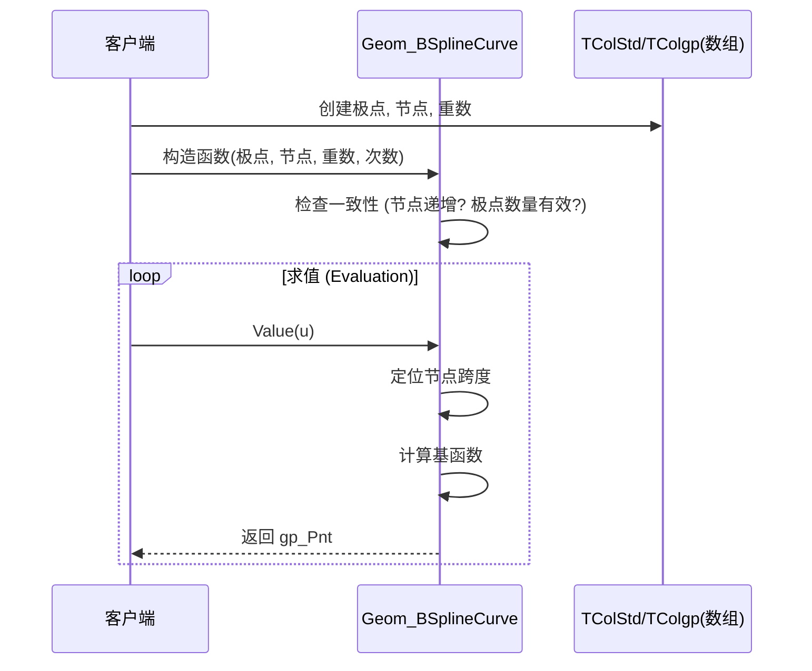

# OCCT Geom 包 - 详细设计与 API 规范

## 1. 详细设计：关键模块

### 1.1. B 样条曲线 (`Geom_BSplineCurve`)
B 样条曲线是系统中最复杂和通用的曲线表示 (NURBS)。

#### 数据结构
*   **极点 / 控制点 (Poles)**：`gp_Pnt` 数组。定义形状外壳。
*   **权重 (Weights)**：`Standard_Real` 数组。可选（用于有理曲线）。定义每个极点的“拉力”。
*   **节点 (Knots)**：`Standard_Real` 数组。定义参数空间划分。
*   **重数 (Multiplicities)**：`Standard_Integer` 数组。定义节点重复的次数（影响连续性）。
*   **次数 (Degree)**：整数。多项式基函数的次数。

#### 算法
*   **求值 (De Boor 算法)**：用于计算点 $C(u)$ 和导数。
    *   找到节点跨度 $u \in [u_i, u_{i+1})$。
    *   对影响此跨度的极点应用递归插值。
*   **节点的插入/移除 (Insertion/Removal of Knots)**：在不改变形状的情况下增加/减少控制的算法（用于细化）。

#### 流程图：曲线创建与求值


### 1.2. 曲面求值 (`Geom_Surface`)
曲面是双参数实体 $S(u, v)$。

#### 算法：导数计算
*   **D0**：点 $P = S(u,v)$
*   **D1**：一阶导数 $\frac{\partial S}{\partial u}, \frac{\partial S}{\partial v}$ (切线)。
*   **D2**：二阶导数 (曲率)。

## 2. 函数接口规范

### 2.1. `Geom_Curve` 接口 (抽象)

| 方法名 | 输入参数 | 输出参数 | 功能 |
| :--- | :--- | :--- | :--- |
| **Value** | `u` (实数): 参数 | `gp_Pnt`: u 处的点 | 计算对应于参数 u 的 3D 点坐标。 |
| **D1** | `u` (实数) | `P` (gp_Pnt): 点<br>`V1` (gp_Vec): 切向量 | 计算 u 处的点和一阶导数向量。 |
| **D2** | `u` (实数) | `P`, `V1`, `V2` (gp_Vec): 二阶导数 | 计算点、一阶和二阶导数（加速度/曲率）。 |
| **FirstParameter** | 无 | `Real` | 返回定义区间的下界。 |
| **LastParameter** | 无 | `Real` | 返回定义区间的上界。 |
| **Continuity** | 无 | `GeomAbs_Shape` (枚举) | 返回全局连续性级别 (C0, C1, C2, CN)。 |

### 2.2. `Geom_BSplineCurve` 接口 (具体)

| 方法名 | 输入参数 | 输出参数 | 功能 |
| :--- | :--- | :--- | :--- |
| **Constructor** (构造函数) | `Poles` (数组), `Weights` (数组, 可选), `Knots` (数组), `Mults` (数组), `Degree` (整数), `Periodic` (布尔) | `Handle(Geom_BSplineCurve)` | 创建新的 NURBS 曲线。验证输入数组大小和节点序列。 |
| **SetPole** | `Index` (整数), `P` (gp_Pnt), `Weight` (实数, 可选) | 无 | 修改 `Index` 处的控制点。局部改变曲线形状。 |
| **InsertKnot** | `U` (实数), `Mult` (整数) | 无 | 在参数 `U` 处插入新节点。不改变形状，增加控制点。 |
| **IsRational** | 无 | `Boolean` | 如果权重不全相等则返回 true（曲线是有理的）。 |

### 2.3. `Geom_Geometry` 接口 (基类)

| 方法名 | 输入参数 | 输出参数 | 功能 |
| :--- | :--- | :--- | :--- |
| **Transform** | `T` (gp_Trsf): 变换矩阵 | 无 | 将变换 `T`（平移、旋转、缩放）应用于对象数据。 |
| **Copy** | 无 | `Handle(Geom_Geometry)` | 创建对象的深拷贝。 |
| **Mirror** | `P` (gp_Pnt) 或 `A` (gp_Ax1/Ax2) | 无 | 执行对称变换。 |

## 3. 数据流图 (概念)

```mermaid
graph LR
    Input[原始坐标 / 参数] -->|gp_Pnt / gp_Trsf| Construction[Geom 构造函数]
    Construction -->|验证| Object[Geom_BSplineCurve 实例]
    Object -->|Value(u)| Point[gp_Pnt (3D 坐标)]
    Object -->|Transform(T)| TransformedObject[变换后的几何]
    Object -->|导出| STEP_File[STEP / IGES 文件]
    
    subgraph "内部状态"
    Object -- 使用 --> Poles[极点数组]
    Object -- 使用 --> Knots[节点数组]
    end
```

## 4. 关键算法详解

### 4.1. 参数化 (Parameterization)
*   **归一化 (Normalized)**：对于许多基本曲线（如直线），参数 $u$ 通常对应于距离。
*   **三角 (Trigonometric)**：对于圆/椭圆，$u$ 对应于弧度角（$0$ 到 $2\pi$）。
*   **非均匀 (Non-Uniform)**：对于 B 样条， $u$ 与弧长之间的关系是非线性的，由节点分布决定。

### 4.2. 变换逻辑 (Transformation Logic)
当调用 `Transform(T)` 时：
1.  **基本曲面**：底层坐标系 (`gp_Ax3`) 被 `T` 变换。如果 `T` 包含缩放，半径/尺寸也会缩放。
2.  **B 样条**：所有极点被 `T` 变换。节点保持不变（除非 `T` 涉及参数缩放，这在刚体变换中很少见）。
