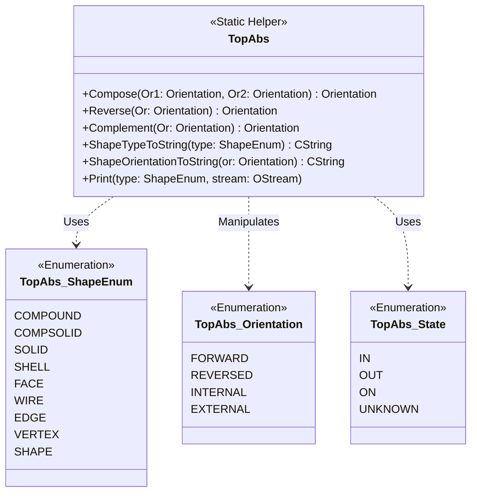

# OCCT Modeling Data - TopAbs Package Detailed Design

## 1. 类图设计 (Class Diagram)

`TopAbs` 包的设计围绕一个静态工具类和三个核心枚举展开。

## 2. 核心算法与逻辑 (Core Algorithms & Logic)

### 2.1 方向合成算法 (Orientation Composition)
函数 `Compose(Or1, Or2)` 用于计算嵌套形状的累积方向。假设形状 S1 包含形状 S2，S1 的方向是 `Or1`，S2 在 S1 中的局部方向是 `Or2`，则 S2 在全局坐标系下的方向是 `Compose(Or1, Or2)`。

**算法逻辑表 (Composition Table):**

| Or1 \ Or2 | FORWARD | REVERSED | INTERNAL | EXTERNAL |
| :--- | :--- | :--- | :--- | :--- |
| **FORWARD** | FORWARD | REVERSED | INTERNAL | EXTERNAL |
| **REVERSED** | REVERSED | FORWARD | INTERNAL | EXTERNAL |
| **INTERNAL** | INTERNAL | INTERNAL | INTERNAL | INTERNAL |
| **EXTERNAL** | EXTERNAL | EXTERNAL | EXTERNAL | EXTERNAL |

*   **FORWARD** 充当单位元。
*   **REVERSED** 充当取反操作。
*   **INTERNAL/EXTERNAL** 具有“吸收”特性，一旦父级是内部或外部，子级通常继承该状态（具体取决于拓扑规则，但在 `Compose` 纯逻辑中如上表所示）。

### 2.2 反转与补集算法 (Reverse & Complement)

*   **Reverse(Or)**: 交换几何方向（材料侧交换）。
    *   FORWARD <-> REVERSED
    *   INTERNAL -> INTERNAL
    *   EXTERNAL -> EXTERNAL
*   **Complement(Or)**: 交换拓扑内外状态（补集操作）。
    *   FORWARD <-> REVERSED
    *   INTERNAL <-> EXTERNAL (内变外，外变内)

## 3. 函数接口说明 (Function Interface Description)

以下列出 `TopAbs` 类中的关键静态函数接口。

### 3.1 Compose
*   **功能**: 合成两个方向。通常用于计算子形状在父形状变换后的最终方向。
*   **输入参数**:
    *   `Or1` (TopAbs_Orientation): 父形状的方向。
    *   `Or2` (TopAbs_Orientation): 子形状相对于父形状的方向。
*   **输出参数**:
    *   (Return Value): 合成后的 `TopAbs_Orientation`。

### 3.2 Reverse
*   **功能**: 反转方向。通常用于反转边的方向或面的法线。
*   **输入参数**:
    *   `Or` (TopAbs_Orientation): 原始方向。
*   **输出参数**:
    *   (Return Value): 反转后的方向。注意 `INTERNAL` 和 `EXTERNAL` 在此操作下保持不变。

### 3.3 Complement
*   **功能**: 计算方向的补集。用于布尔运算中的求补操作。
*   **输入参数**:
    *   `Or` (TopAbs_Orientation): 原始方向。
*   **输出参数**:
    *   (Return Value): 互补方向。`INTERNAL` 会变为 `EXTERNAL`，反之亦然。

### 3.4 ShapeTypeToString / FromString
*   **功能**: 枚举与字符串的相互转换。
*   **输入参数**:
    *   `theType` (TopAbs_ShapeEnum) / `theTypeString` (Standard_CString)
*   **输出参数**:
    *   (Return Value): 对应的字符串名称或枚举值。
*   **流程**: 内部使用静态字符串数组查找，支持不区分大小写的比较。

## 4. 数据流 (Data Flow)

虽然 `TopAbs` 是无状态的，但数据流通常如下：

1.  **输入**: 原始拓扑数据（如读取 BREP 文件）。
2.  **处理**: `TopoDS` 模块读取字符串，调用 `TopAbs::ShapeTypeFromString` 转换为枚举。
3.  **运算**: 建模算法（如 `BRepAlgoAPI`）在遍历拓扑图时，调用 `TopAbs::Compose` 计算当前边的实际方向。
4.  **输出**: 结果被存储回 `TopoDS_Shape` 结构中，或通过 `TopAbs::Print` 输出日志。
